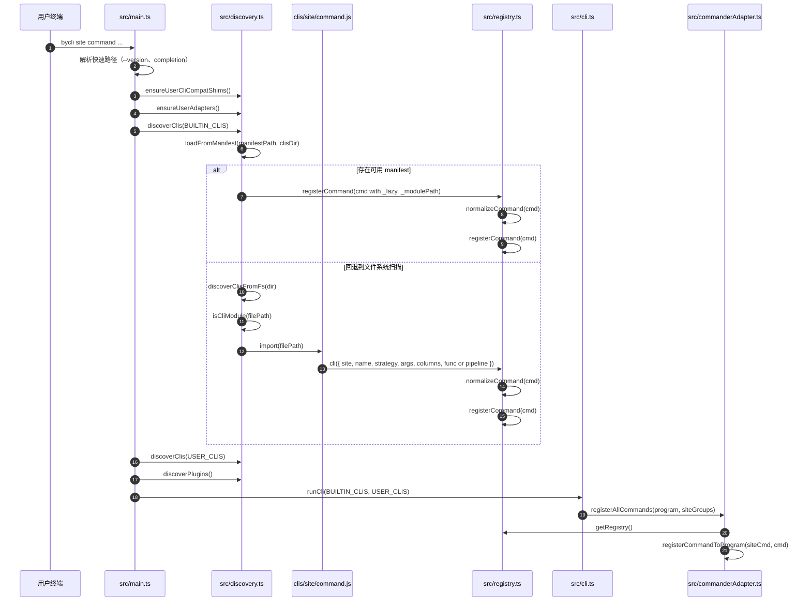

# 阶段 1：启动发现与注册

这个阶段回答一个问题：`clis/<site>/<command>.js` 这样的 adapter 文件，是怎么被 byCLI 找到并注册成命令的？

## 时序图

## 关键方法解析

| 方法 | 文件 | 作用 | 理解要点 |
|---|---|---|---|
| `discoverClis(...dirs)` | `src/discovery.ts:95` | 发现并注册 adapter 命令。 | 对每个目录先尝试 `cli-manifest.json` 快路径；manifest 不可用时回退到文件扫描。 |
| `loadFromManifest(manifestPath, clisDir)` | `src/discovery.ts:114` | 从预编译 manifest 注册命令元数据。 | 这里不会立刻 import adapter 文件，而是注册带 `_lazy` 和 `_modulePath` 的命令，等执行时再加载。 |
| `discoverClisFromFs(dir)` | `src/discovery.ts:154` | 开发模式下扫描 `clis/<site>/*.js`。 | 会跳过 YAML、TS、测试文件；只有通过 `isCliModule()` 判断的 JS 文件才会被 import。 |
| `isCliModule(filePath)` | `src/discovery.ts:232` | 判断一个 JS 文件是否是命令模块。 | 通过源码正则找 `cli(` 或 hook 注册调用，避免 import 普通 helper 文件。 |
| `discoverPlugins()` | `src/discovery.ts:189` | 扫描 `~/.bycli/plugins/`。 | 插件目录是扁平扫描，不像内置 adapter 那样有 `site/command.js` 两级结构。 |
| `cli(opts)` | `src/registry.ts:151` | adapter 注册入口。 | adapter 文件调用它后，命令会被放入全局 registry。 |
| `normalizeCommand(cmd)` | `src/registry.ts:202` | 根据 `strategy` 推导运行时字段。 | 重点看它如何把 `Strategy.PUBLIC/COOKIE/UI` 等转成 `browser` 和 `navigateBefore`。 |
| `registerCommand(cmd)` | `src/registry.ts:240` | 写入全局 registry。 | key 是 `site/name`，同时会注册 alias；后注册的同名命令会覆盖旧命令。 |
| `getRegistry()` | `src/registry.ts:177` | 取全局命令表。 | 后续 Commander 装配命令、执行懒加载命令都会回到这里查。 |
| `registerAllCommands(program, siteGroups)` | `src/commanderAdapter.ts:193` | 把 registry 里的命令挂到 Commander。 | 按 `site` 分组生成 `bycli <site> <command>` 结构。 |

## 这一阶段的核心原理

adapter 的发现有两条路：

1. 生产路径：`manifest -> registerCommand(lazy metadata)`。
2. 开发路径：`scan JS file -> import -> adapter calls cli() -> registerCommand()`。

两条路最终都会进入同一个 registry，所以后面的执行阶段不需要关心命令来自内置 adapter、用户 adapter，还是 plugin。

