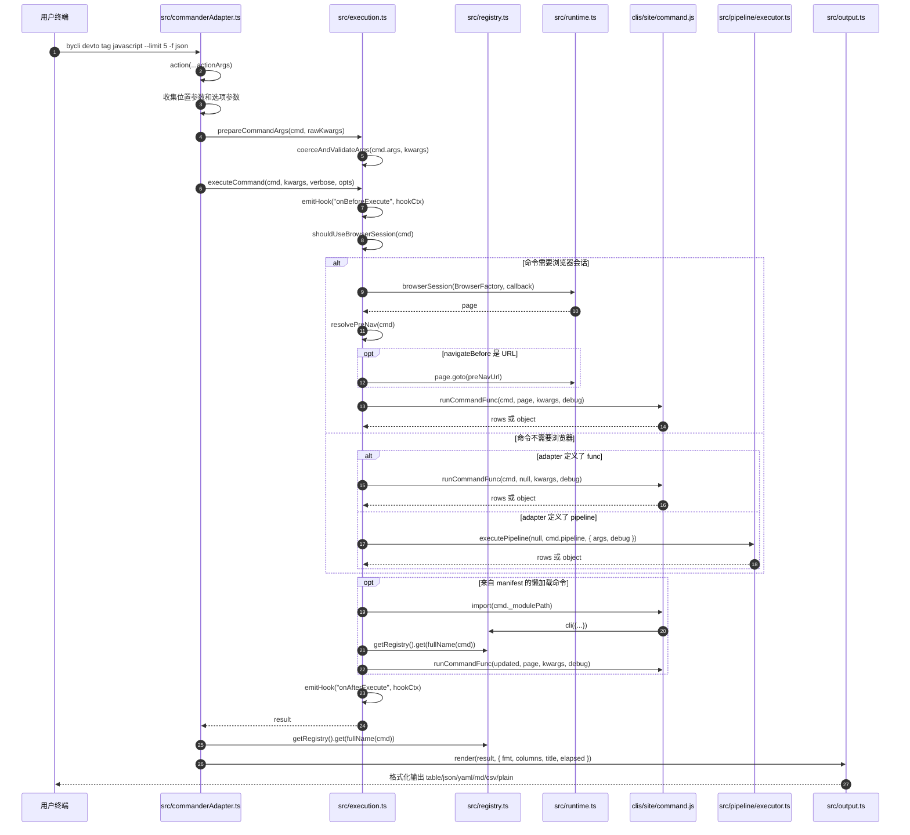

# 阶段 2：命令解析与执行调度

这个阶段回答一个问题：用户输入 `bycli devto tag javascript --limit 5 -f json` 后，byCLI 是怎么把终端参数变成 adapter 调用的？

## 时序图

## 关键方法解析

| 方法 | 文件 | 作用 | 理解要点 |
|---|---|---|---|
| `registerCommandToProgram(siteCmd, cmd)` | `src/commanderAdapter.ts:39` | 把单个 `CliCommand` 注册成 Commander 子命令。 | 根据 `cmd.args` 创建位置参数和选项参数，再加上通用 `-f/--format`、`--trace`、`-v`。 |
| `subCmd.action(...)` | `src/commanderAdapter.ts:81` | Commander 命令真正被调用时的入口。 | 收集 `actionArgs` 和 options，组装成 adapter 能理解的 `rawKwargs`。 |
| `prepareCommandArgs(cmd, rawKwargs)` | `src/execution.ts:473` | 参数准备入口。 | 处理 Commander 对 kebab-case 的转换、默认值、required、choices 等细节。 |
| `coerceAndValidateArgs(cmd.args, kwargs)` | `src/execution.ts:53` | 参数类型转换和校验。 | `int/number` 转数字，`boolean` 转布尔值，缺 required 参数时抛 `ArgumentError`。 |
| `executeCommand(cmd, rawKwargs, debug, opts)` | `src/execution.ts:196` | 所有 adapter 的统一执行入口。 | 这里负责 hooks、trace、timeout、浏览器会话、预导航、懒加载和最终调用。 |
| `shouldUseBrowserSession(cmd)` | `src/capabilityRouting.ts:46` | 判断是否需要浏览器。 | 看 `cmd.browser`、`cmd.func`、`cmd.pipeline`、`navigateBefore`，以及 pipeline 里是否有浏览器步骤。 |
| `browserSession(BrowserFactory, callback)` | `src/runtime.ts:73` | 创建并关闭浏览器会话。 | 内部调用 `browser.connect()` 得到 `page`，callback 结束后在 `finally` 里关闭。 |
| `resolvePreNav(cmd)` | `src/execution.ts:160` | 决定 adapter 执行前是否要先打开某个 URL。 | `Strategy.COOKIE + domain` 通常会在注册阶段推导出 `navigateBefore`。 |
| `runCommand(cmd, page, kwargs, debug)` | `src/execution.ts:97` | 真正选择执行 `func` 还是 `pipeline`。 | 如果命令来自 manifest 且 `_lazy`，这里会先 import adapter 模块，再从 registry 取更新后的命令。 |
| `runCommandFunc(cmd, page, kwargs, debug)` | `src/execution.ts:152` | 调用 adapter 的 `func`。 | `browser:false` 时调用 `func(kwargs, debug)`；`browser:true` 时调用 `func(page, kwargs, debug)`。 |
| `render(result, options)` | `src/output.ts` | 输出格式化。 | 根据 `-f/--format` 和 `columns` 输出 table、json、yaml、md、csv 或 plain。 |

## 这一阶段的核心原理

`commanderAdapter.ts` 是薄层，只负责命令行参数到 `kwargs` 的翻译。真正复杂的运行时调度都在 `execution.ts`：

- 要不要浏览器：`shouldUseBrowserSession(cmd)`。
- 要不要预导航：`resolvePreNav(cmd)`。
- adapter 是否懒加载：看 `_lazy` 和 `_modulePath`。
- adapter 怎么执行：`func` 走 `runCommandFunc()`，`pipeline` 走 `executePipeline()`。

