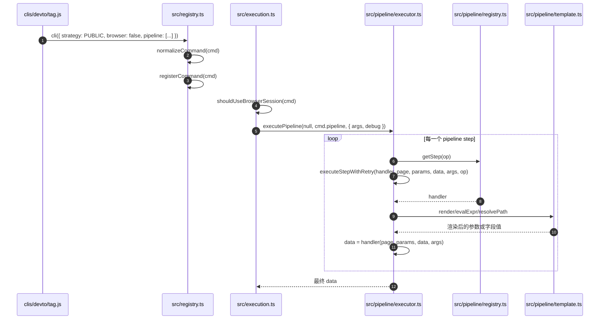

# 阶段 3：Pipeline Adapter 执行原理

这个阶段回答一个问题：像 `clis/devto/tag.js` 这种声明式 adapter，为什么不用写 `func` 也能执行？

## 示例 Adapter

`clis/devto/tag.js` 的核心形态：

```js
cli({
  site: 'devto',
  name: 'tag',
  strategy: Strategy.PUBLIC,
  browser: false,
  args: [...],
  columns: [...],
  pipeline: [
    { fetch: { url: 'https://dev.to/api/articles?tag=${{ args.tag }}&per_page=${{ args.limit }}' } },
    { map: { ... } },
    { limit: '${{ args.limit }}' },
  ],
});
```

## 时序图



## 关键方法解析

| 方法 | 文件 | 作用 | 理解要点 |
|---|---|---|---|
| `cli({... pipeline })` | `clis/devto/tag.js:2` | 声明 adapter 的 pipeline。 | adapter 不写 `func`，而是交给 pipeline executor 逐步执行。 |
| `shouldUseBrowserSession(cmd)` | `src/capabilityRouting.ts:46` | 判断 pipeline 是否需要浏览器。 | `browser:false` 直接不需要浏览器；如果 `browser:true` 且 pipeline 包含 `navigate/evaluate/click` 等浏览器步骤，则需要浏览器。 |
| `executePipeline(page, pipeline, ctx)` | `src/pipeline/executor.ts:20` | 顺序执行 pipeline。 | 维护一个 `data` 变量，每个 step 接收上一步结果，并返回下一步结果。 |
| `executeStepWithRetry(...)` | `src/pipeline/executor.ts:60` | 执行单个 step，并在浏览器瞬时错误时重试。 | 浏览器步骤默认最多重试 2 次，非浏览器步骤默认不重试。 |
| `getStep(op)` | `src/pipeline/registry.ts` | 按 step 名字找到处理器。 | 例如 `fetch`、`map`、`limit` 都是提前注册好的 step handler。 |
| `registerStep(name, handler)` | `src/pipeline/registry.ts:52` | 注册 pipeline step。 | `src/pipeline/registry.ts` 初始化时会注册 `fetch/map/filter/sort/limit/navigate/evaluate` 等步骤。 |
| `render(...)` / `evalExpr(...)` / `resolvePath(...)` | `src/pipeline/template.ts` | 解析 `${{ ... }}` 模板表达式。 | 让 pipeline 能引用 `args.tag`、`args.limit`、`item.title`、`index` 等上下文变量。 |
| `columns` | adapter 文件 | 控制最终输出列。 | pipeline 最终返回对象数组，`columns` 决定 table/md/csv 等格式的列顺序。 |

## 这一阶段的核心原理

Pipeline adapter 把“怎么拿数据、怎么变形、怎么裁剪”写成声明式步骤。执行器只做一件事：从上到下跑 step，并把每一步输出作为下一步输入。

典型数据流：

```text
fetch 返回原始 JSON
  -> map 把每个 item 转成统一 row
  -> limit 截断数量
  -> output 按 columns 渲染
```

这种形态适合公开 HTTP API、结构清晰、无需登录态或复杂页面交互的网站。

