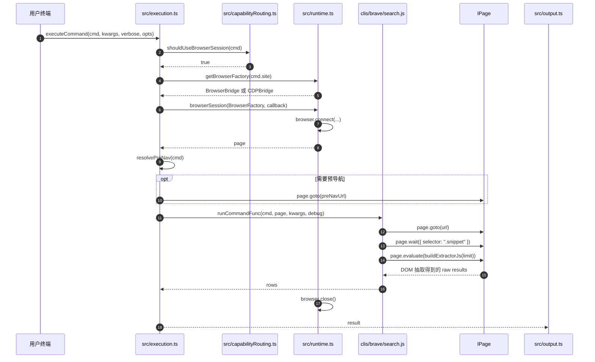

# 阶段 4：Browser Function Adapter 执行原理

这个阶段回答一个问题：像 `clis/brave/search.js` 这种需要真实页面的 adapter，`page` 是从哪里来的，又是怎么被传进 `func(page, kwargs)` 的？

## 示例 Adapter

`clis/brave/search.js` 的核心形态：

```js
cli({
  site: 'brave',
  name: 'search',
  strategy: Strategy.PUBLIC,
  browser: true,
  args: [...],
  columns: ['rank', 'title', 'url', 'snippet'],
  func: async (page, kwargs) => {
    await page.goto(url);
    await page.wait({ selector: '.snippet', timeout: 10 });
    const raw = await page.evaluate(buildExtractorJs(limit));
    return rows;
  },
});
```

## 时序图



## 关键方法解析

| 方法 | 文件 | 作用 | 理解要点 |
|---|---|---|---|
| `cli({... browser: true, func })` | `clis/brave/search.js:38` | 声明一个需要浏览器的 function adapter。 | `browser:true` 决定 `func` 签名是 `(page, kwargs, debug)`。 |
| `shouldUseBrowserSession(cmd)` | `src/capabilityRouting.ts:46` | 判断是否要创建浏览器会话。 | 对 browser function adapter 来说，只要 `cmd.func` 存在且 `cmd.browser` 为 true，就需要浏览器。 |
| `getBrowserFactory(site)` | `src/runtime.ts:11` | 选择浏览器桥接实现。 | 普通网站使用 `BrowserBridge`；注册过的 Electron app 使用 `CDPBridge`。 |
| `browserSession(BrowserFactory, callback)` | `src/runtime.ts:73` | 管理浏览器连接生命周期。 | 先 `browser.connect()` 得到 `page`，callback 结束后无论成功失败都会 `browser.close()`。 |
| `resolvePreNav(cmd)` | `src/execution.ts:160` | 决定 adapter func 前是否先打开目标域名。 | `Strategy.COOKIE` 且有 `domain` 时，常用于先进入站点以拿到登录态上下文。 |
| `runCommandFunc(cmd, page, kwargs, debug)` | `src/execution.ts:152` | 把 `page` 传给 adapter 的 `func`。 | 如果 `cmd.browser === false`，不会传 page；如果需要浏览器但 page 为空，会抛执行错误。 |
| `buildExtractorJs(limit)` | `clis/brave/search.js:12` | 构造注入页面执行的抽取脚本。 | 这个函数返回字符串，后面交给 `page.evaluate(...)` 在页面上下文运行。 |
| `page.goto(url)` | `clis/brave/search.js:59` | 打开目标页面。 | browser adapter 通常先导航，再等待页面关键元素或接口。 |
| `page.wait(...)` | `clis/brave/search.js:61` | 等待页面进入可抽取状态。 | Brave 示例等待 `.snippet` 出现；失败时 fallback 到短暂等待。 |
| `page.evaluate(...)` | `clis/brave/search.js:65` | 在页面里执行 DOM 抽取。 | 返回原始数组后，adapter 再映射成符合 `columns` 的 rows。 |

## 这一阶段的核心原理

Browser function adapter 的核心是：`execution.ts` 负责拿到浏览器 `page`，adapter 只关心如何用这个 `page` 完成业务动作。

典型数据流：

```text
browserSession 创建 page
  -> adapter func(page, kwargs)
  -> page.goto 打开页面
  -> page.wait 等页面稳定
  -> page.evaluate 抽 DOM 或页面状态
  -> adapter 整理 rows
  -> output 按 columns 渲染
```

这种形态适合需要页面渲染、登录态、DOM 选择器、用户界面交互或浏览器环境签名的网站。

