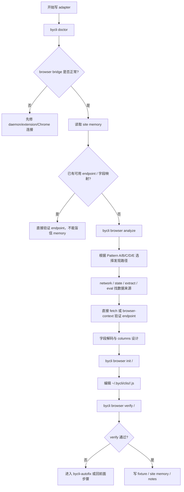

# bycli-adapter-author 技能与实现原理

本文介绍 `skills/bycli-adapter-author/SKILL.md` 这个技能的用途、工作流，以及它在 byCLI 代码中依赖的关键实现。

## 技能定位

`bycli-adapter-author` 是给 AI agent 写新 adapter 用的操作手册。它不是运行时代码，也不是一个新的 CLI 命令；它是一份本地 `SKILL.md`，告诉 agent 如何用现有 byCLI 能力完成这条闭环：

```text
站点侦察
  -> API / DOM / SSR 数据发现
  -> 字段解码
  -> 输出结构设计
  -> bycli browser init 生成 adapter
  -> bycli browser verify 验证
  -> 写回 site memory / fixture
```

它的目标很明确：让 agent 在写 adapter 时不要靠猜，而是用 `bycli browser *`、fixture、trace、site memory 形成可复查的证据链。

## 文件入口

| 文件 | 作用 |
|---|---|
| `skills/bycli-adapter-author/SKILL.md` | 主 runbook：从冷启动到 verify 的 12 步。 |
| `skills/bycli-adapter-author/references/coverage-matrix.md` | 判断这个站点/任务是否适合写 adapter。 |
| `skills/bycli-adapter-author/references/site-recon.md` | 站点形态判断：Pattern A/B/C/D/E。 |
| `skills/bycli-adapter-author/references/api-discovery.md` | 找 API endpoint 的方法。 |
| `skills/bycli-adapter-author/references/field-conventions.md` | 常见字段代号含义。 |
| `skills/bycli-adapter-author/references/field-decode-playbook.md` | 未知字段如何解码。 |
| `skills/bycli-adapter-author/references/output-design.md` | columns 命名、类型、顺序规范。 |
| `skills/bycli-adapter-author/references/adapter-template.md` | adapter 文件结构和模板。 |
| `skills/bycli-adapter-author/references/site-memory.md` | `~/.bycli/sites/<site>/` 的记忆结构。 |
| `skills/bycli-adapter-author/references/typed-errors.md` | adapter 应该抛哪些 typed error。 |

## 工作流总览



## 它如何判断站点形态

skill 里要求优先跑：

```bash
bycli browser analyze <url>
```

这个命令在代码里不是 LLM 猜的，而是 `src/cli.ts` 驱动真实页面，收集网络、cookie、SSR globals，再交给 `src/browser/analyze.ts` 做分类。

关键代码摘录：

```ts
// src/cli.ts
addBrowserTabOption(browser.command('analyze').argument('<url>'))
  .description('Classify site: anti-bot vendor, pattern (A/B/C/D), nearest adapter, recommended next step')
  .action(browserAction(async (page, url) => {
    const hasSessionCapture = await page.startNetworkCapture?.() ?? false;
    await page.goto(url);
    await page.wait(2);

    if (!hasSessionCapture) {
      await page.evaluate(NETWORK_INTERCEPTOR_JS).catch(() => {});
    }

    const rawItems = await captureNetworkItems(page);
    const networkEntries = rawItems.map((e) => ({
      url: e.url,
      status: e.status,
      contentType: e.ct,
      bodyPreview: typeof e.body === 'string'
        ? e.body.slice(0, 2000)
        : (e.body ? JSON.stringify(e.body).slice(0, 2000) : null),
    }));

    const probe = await page.evaluate(probeJs);
    const signals = { requestedUrl: url, finalUrl: probe.finalUrl, networkEntries, ... };
    const report = analyzeSite(signals, getRegistry());
    console.log(JSON.stringify(report, null, 2));
  }));
```

`analyzeSite()` 的核心是把真实页面信号变成下一步建议：

```ts
// src/browser/analyze.ts
export function analyzeSite(signals: PageSignals, registry: Map<string, CliCommand>): AnalyzeReport {
  const pattern = classifyPattern(signals);
  const antiBot = detectAntiBot(signals);
  const nearest = findNearestAdapter(signals.finalUrl, registry);

  let next: string;
  if (antiBot.detected) {
    next = antiBot.implication;
  } else if (pattern.pattern === 'A') {
    next = 'Pick the most specific JSON endpoint from `bycli browser network`...';
  } else if (pattern.pattern === 'B') {
    next = 'Read the SSR global via `bycli browser eval ...`';
  } else if (pattern.pattern === 'C') {
    next = 'No API visible — use SSR HTML scrape...';
  }

  return { requested_url, final_url, pattern, anti_bot: antiBot, nearest_adapter: nearest, recommended_next_step: next };
}
```

这就是 skill 里“先侦察、再写 adapter”的实现基础。

## 它如何生成 adapter 骨架

skill 要求用：

```bash
bycli browser init <site>/<command>
```

对应代码在 `src/cli.ts`，会写入用户目录：

```ts
// src/cli.ts
browser.command('init')
  .argument('<name>', 'Adapter name in site/command format (e.g. hn/top)')
  .description('Generate adapter scaffold in ~/.bycli/clis/')
  .action(async (name: string) => {
    const [site, command] = name.split('/');
    const dir = path.join(os.homedir(), '.bycli', 'clis', site);
    const filePath = path.join(dir, `${command}.js`);

    const template = `import { cli, Strategy } from '@sovovs/bycli/registry';

cli({
  site: '${site}',
  name: '${command}',
  strategy: Strategy.PUBLIC,
  browser: false,
  args: [
    { name: 'limit', type: 'int', default: 10, help: 'Number of items' },
  ],
  columns: [],
  func: async (kwargs) => {
    return [];
  },
});
`;
    fs.mkdirSync(dir, { recursive: true });
    fs.writeFileSync(filePath, template, 'utf-8');
  });
```

这里有几个设计点：

| 设计 | 原因 |
|---|---|
| 写入 `~/.bycli/clis/<site>/<cmd>.js` | 个人 adapter 不需要改 repo，也不需要 build。 |
| 默认 `browser: false` | 鼓励优先 API / Node fetch，浏览器自动化是 fallback。 |
| 默认 `Strategy.PUBLIC` | 先从无鉴权开始，再根据验证结果改 COOKIE / UI / INTERCEPT。 |
| `columns: []` 明确留空 | 强迫作者设计输出字段，而不是随手返回巨大对象。 |

## 它如何验证 adapter

skill 的收口动作是：

```bash
bycli browser verify <site>/<command>
```

这个命令不只是“跑一下 adapter”。它做了四件事：

1. 找到 `~/.bycli/clis/<site>/<command>.js`。
2. 用子进程执行 `bycli <site> <command> --format json`。
3. 把输出规范化成 rows。
4. 用 fixture 和 row shape 规则做结构校验。

关键代码摘录：

```ts
// src/cli.ts
browser.command('verify')
  .argument('<name>', 'Adapter name in site/command format')
  .option('--write-fixture')
  .option('--update-fixture')
  .option('--no-fixture')
  .option('--seed-args <value>')
  .option('--trace <mode>', 'Trace capture for the adapter subprocess: off, on, retain-on-failure', 'off')
  .action(async (name, opts) => {
    const [site, command] = name.split('/');
    const filePath = path.join(os.homedir(), '.bycli', 'clis', site, `${command}.js`);

    const fixture = opts.fixture !== false ? loadFixture(site, command) : null;
    const cliArgs = expandFixtureArgs(fixture?.args ?? parseSeedArgs(opts.seedArgs));
    const traceArgs = opts.trace && opts.trace !== 'off' ? ['--trace', opts.trace] : [];

    const execArgs = [...invocation.args, site, command, ...cliArgs, ...traceArgs, '--format', 'json'];
    const rawJson = execFileSync(invocation.binary, execArgs, { encoding: 'utf-8' });

    const rows = normalizeVerifyRows(JSON.parse(rawJson));
    const shapeFailures = validateRowShape(rows);
    const failures = fixture ? validateRows(rows, fixture) : [];
  });
```

fixture 校验逻辑在 `src/browser/verify-fixture.ts`：

```ts
export function deriveFixture(rows: Row[], args?: FixtureArgs): Fixture {
  const expect: FixtureExpect = {};
  if (rows.length === 0) {
    expect.rowCount = { min: 0 };
    return { ...(args ? { args } : {}), expect };
  }

  expect.rowCount = { min: 1 };
  expect.columns = Object.keys(rows[0]);

  const types: Record<string, string> = {};
  for (const col of expect.columns) {
    const observed = new Set<string>();
    for (const row of rows) observed.add(jsType(row[col]));
    types[col] = [...observed].sort().join('|');
  }
  expect.types = types;

  return { ...(args ? { args } : {}), expect };
}
```

`validateRows()` 会检查：

| 规则 | 能挡住的问题 |
|---|---|
| `rowCount` | 空结果或数量异常。 |
| `columns` | 缺列、字段名变动。 |
| `types` | 数字/字符串/null 类型漂移。 |
| `patterns` | URL、ID、日期等格式错误。 |
| `notEmpty` | 核心字段为空。 |
| `mustNotContain` | 字段污染，例如 description 混入地址/分类。 |
| `mustBeTruthy` | `|| 0`、`|| false` 这类 silent fallback。 |
| `validateRowShape()` | 顶层字段太多、嵌套太深、id 藏在深层。 |

这就是 skill 里强调“verify 通过后还要写 fixture”的原因：没有 fixture，verify 只能证明“能跑”，不能证明“数据形状正确”。

## Adapter 运行时如何接入 browser

当 adapter metadata 里 `browser: true` 时，实际执行路径走 `src/execution.ts`。它会创建 `surface: 'adapter'` 的 `Page`，并把这个 `page` 传给 adapter 的 `func(page, kwargs, debug)`。

关键代码摘录：

```ts
// src/execution.ts
if (shouldUseBrowserSession(cmd)) {
  const BrowserFactory = getBrowserFactory(cmd.site);
  const contextId = resolveProfileContextId(opts.profile);
  const siteSession = resolveSiteSession(cmd, opts.siteSession);
  const session = resolveAdapterBrowserSession(cmd, siteSession);
  const keepTab = resolveKeepTab(siteSession, opts.keepTab);
  const windowMode = resolveBrowserWindowMode('background', opts.windowMode);

  result = await browserSession(BrowserFactory, async (page) => {
    const preNavUrl = resolvePreNav(cmd);
    if (preNavUrl) await page.goto(preNavUrl);

    const result = await runWithTimeout(runCommand(cmd, page, kwargs, debug), {
      timeout: browserTimeout,
      label: fullName(cmd),
    });

    if (!keepTab) await page.closeWindow?.().catch(() => {});
    return result;
  }, { session, contextId, windowMode, surface: 'adapter', siteSession });
}
```

这解释了两个 skill 约定：

| 约定 | 代码原因 |
|---|---|
| 浏览器型 adapter 调试时用 `--keep-tab true --window foreground` | `executeCommand()` 默认 background + 命令结束释放 lease。 |
| persistent site session 用 `site:<site>` | `resolveAdapterBrowserSession()` persistent 时返回稳定 session。 |
| 默认 ephemeral 用 UUID | 避免不同 adapter 执行互相污染 tab 状态。 |

## Site memory 的作用

`bycli-adapter-author` 不希望每个 agent 都从 0 开始重新抓包，所以它规定把验证过的知识写回：

```text
~/.bycli/sites/<site>/
  endpoints.json
  field-map.json
  notes.md
  verify/<cmd>.json
  fixtures/<cmd>-<timestamp>.json
```

实现上，byCLI 主要直接读取 `verify/<cmd>.json` 做自动验证；其它 memory 文件更多是 skill 给 agent 的知识库约定。也就是说：

| 文件 | 谁强依赖 |
|---|---|
| `verify/<cmd>.json` | `bycli browser verify` 会读取并校验。 |
| `endpoints.json` | skill / agent 读取，用于减少重复侦察。 |
| `field-map.json` | skill / agent 读取，用于字段解码。 |
| `notes.md` | skill / agent 读取，用于记录站点坑点。 |
| `fixtures/*.json` | 人和 agent 复查字段时使用。 |

## 这个 skill 的本质

`bycli-adapter-author` 的实现原理可以概括为：

```text
Skill.md 负责约束 agent 的决策过程；
bycli browser analyze/find/network/extract 负责收集站点证据；
bycli browser init 负责落地 adapter 骨架；
bycli browser verify + fixture 负责把“能跑”升级成“形状可信”；
site memory 负责让下一次 agent 不再从 0 开始。
```

它真正防止的不是语法错误，而是更隐蔽的 adapter 错误：字段错位、单位错、空结果误判、selector 漂移、接口过期、verify 只看“有输出”却没看“输出是否可信”。
