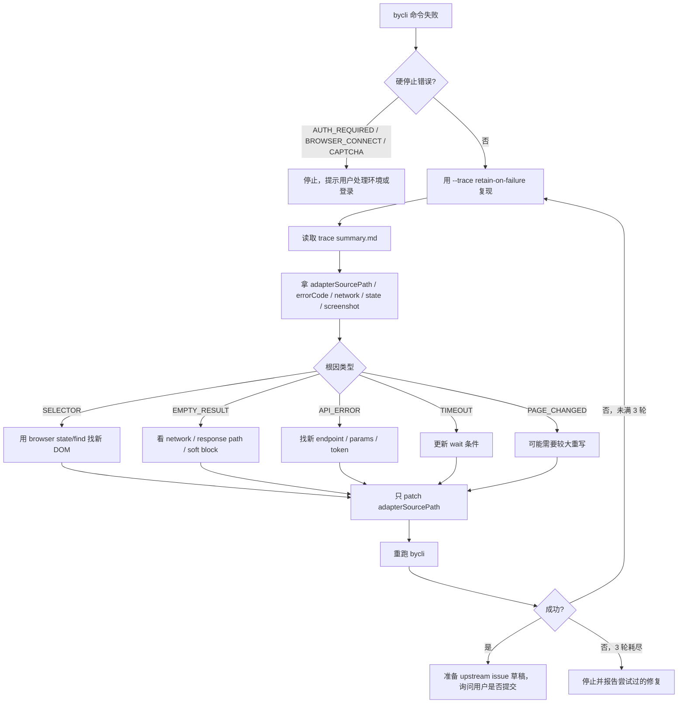

# bycli-autofix 技能与实现原理

本文介绍 `skills/bycli-autofix/SKILL.md` 这个技能的用途、修复流程，以及它依赖的 byCLI trace / adapter source / browser verify 代码。

## 技能定位

`bycli-autofix` 是给 AI agent 修复已损坏 adapter 用的操作手册。它的触发场景是：

```text
bycli <site> <command> 失败
  -> 站点 DOM / API / response schema 可能变了
  -> agent 需要收集 trace
  -> 定位 adapterSourcePath
  -> 只改对应 adapter 文件
  -> 重跑验证
  -> 成功后可准备 upstream issue
```

它和 `bycli-adapter-author` 的区别：

| 技能 | 场景 | 主要目标 |
|---|---|---|
| `bycli-adapter-author` | 从 0 写新 adapter 或加新命令 | 找数据源、设计输出、写 adapter、verify。 |
| `bycli-autofix` | 已有 adapter 失败 | 通过 trace 定位漂移点，做最小修复并重试。 |

## 安全边界

`bycli-autofix` 的第一原则是：不是所有失败都该改代码。

| 情况 | 行为 |
|---|---|
| `AUTH_REQUIRED` / exit 77 | 停止，不改 adapter；让用户登录。 |
| `BROWSER_CONNECT` / exit 69 | 停止，不改 adapter；让用户跑 `bycli doctor`。 |
| CAPTCHA / rate limit | 停止，这不是 adapter 代码问题。 |
| empty result 但站点可能真的没数据 | 先重试不同 query / 正常 Chrome spot-check，不急着修。 |
| trace 指向的 `adapterSourcePath` 不存在 | 不盲改其它文件，先说明证据不足。 |

最关键的 scope 约束：

```text
只改 trace summary.md front matter 里的 adapterSourcePath。
不要改 src/、extension/、tests/、package.json、tsconfig.json。
```

## 修复流程



## trace 是如何产生的

用户或 agent 运行：

```bash
bycli <site> <command> ... --trace retain-on-failure
```

`--trace` 从 `src/commanderAdapter.ts` 传入 `executeCommand()`：

```ts
// src/commanderAdapter.ts
const result = await executeCommand(cmd, kwargs, verbose, {
  prepared: true,
  ...(typeof optionsRecord.trace === 'string' && optionsRecord.trace !== 'off'
    ? { trace: optionsRecord.trace }
    : {}),
  ...(cmd.browser && typeof optionsRecord.window === 'string'
    ? { windowMode: optionsRecord.window }
    : {}),
});
```

`src/execution.ts` 收到 trace mode 后，在 browser adapter 执行期间创建 `ObservationSession`：

```ts
// src/execution.ts
const observation = traceMode === 'off'
  ? null
  : new ObservationSession({
      scope: {
        contextId,
        session,
        target: page.getActivePage?.(),
        site: cmd.site,
        command: fullName(cmd),
        adapterSourcePath: resolveAdapterSourcePath(internal),
      },
    });
```

失败时收集证据：

```ts
// src/execution.ts
catch (err) {
  if (observation) {
    observation.record({
      stream: 'action',
      name: 'command',
      phase: 'error',
      data: { error: err instanceof Error ? err.message : String(err) },
    });
    observation.record({
      stream: 'error',
      message: err instanceof Error ? err.message : String(err),
      stack: err instanceof Error ? err.stack : undefined,
    });
    if (traceMode === 'on' || traceMode === 'retain-on-failure') {
      await collectObservationEvidence(observation, page).catch(() => {});
      exportTraceArtifact(observation, 'failure', err, opts.onTraceExport);
    }
  }
  throw err;
}
```

`collectObservationEvidence()` 会尽量拿到最终页面证据：

```ts
// src/execution.ts
async function collectObservationEvidence(session: ObservationSession, page: IPage): Promise<void> {
  const [url, snapshot, networkEntries, consoleMessages, screenshot] = await Promise.all([
    page.getCurrentUrl?.().catch(() => null) ?? Promise.resolve(null),
    page.snapshot().catch(() => undefined),
    page.readNetworkCapture?.().catch(() => []) ?? Promise.resolve([]),
    page.consoleMessages('all').catch(() => []),
    page.screenshot({ format: 'png' }).catch(() => undefined),
  ]);

  session.record({ stream: 'state', url, target, snapshot, label: 'final' });
  for (const entry of networkEntries) session.record({ stream: 'network', ... });
  for (const message of consoleMessages) session.record({ stream: 'console', ... });
  if (screenshot) session.record({ stream: 'screenshot', format: 'png', data: screenshot });
}
```

所以 autofix 不是只看错误字符串，而是看：

| 证据 | 用途 |
|---|---|
| final state | DOM 是否改版、selector 是否失效。 |
| network entries | endpoint、状态码、response body 是否变了。 |
| console | 前端 JS 错误、blocked、CORS、WAF 线索。 |
| screenshot | 页面是否进了登录页、验证码、空状态。 |
| error stack | adapter 里具体哪段逻辑抛错。 |

## trace artifact 目录结构

真正写文件的是 `src/observation/artifact.ts`：

```ts
// src/observation/artifact.ts
export function exportObservationSession(session: ObservationSession, opts = {}): ObservationExportResult {
  const dir = getTraceDirectory(session.scope.contextId, session.id, opts.baseDir);
  fs.mkdirSync(dir, { recursive: true });
  fs.mkdirSync(path.join(dir, 'screenshots'), { recursive: true });
  fs.mkdirSync(path.join(dir, 'state'), { recursive: true });

  fs.writeFileSync(path.join(dir, 'trace.jsonl'), traceLines.join('\n') + '\n');
  fs.writeFileSync(path.join(dir, 'network.jsonl'), networkLines.join('\n') + '\n');
  fs.writeFileSync(path.join(dir, 'console.jsonl'), consoleLines.join('\n') + '\n');

  const summaryPath = path.join(dir, 'summary.md');
  fs.writeFileSync(summaryPath, renderSummary(session, sanitizedEvents, { ... }));

  const receiptPath = path.join(dir, 'receipt.json');
  const receipt = buildTraceReceipt(resultBase, status, opts.error, { scope: session.scope });
  fs.writeFileSync(receiptPath, JSON.stringify(receipt, null, 2));

  return { ...resultBase, receipt };
}
```

输出目录大致是：

```text
~/.bycli/profiles/<contextId>/traces/<traceId>/
  summary.md
  receipt.json
  trace.jsonl
  network.jsonl
  console.jsonl
  state/
  screenshots/
```

其中 `summary.md` 是 autofix 的第一入口。它的 front matter 会包含：

```yaml
schemaVersion: 1
bycliVersion: "..."
traceId: "..."
status: failure
contextId: "default"
session: "site:..."
site: "zhihu"
command: "zhihu/hot"
adapterSourcePath: "/Users/.../clis/zhihu/hot.js"
adapterSourcePathExists: true
errorCode: "SELECTOR"
errorMessage: "Could not find element: ..."
```

`renderSummary()` 还会把 Failed Network、Suspicious Console、Action Timeline、Event Counts、Artifact Files 都写进 summary，方便 agent 先读摘要，不必立刻打开全部 JSONL。

## adapterSourcePath 为什么可靠

autofix 要求“只改 `adapterSourcePath`”，这个路径由 `src/adapter-source.ts` 解析：

```ts
// src/adapter-source.ts
export function resolveAdapterSourcePath(cmd: InternalCliCommand): string | undefined {
  const candidates: string[] = [];

  if (cmd.source && !cmd.source.startsWith('manifest:')) {
    candidates.push(cmd.source);
  }
  if (cmd._modulePath) {
    candidates.push(cmd._modulePath);
  }

  for (const candidate of candidates) {
    if (fs.existsSync(candidate)) return candidate;
  }

  return candidates[0];
}
```

它的优先级：

1. `cmd.source`：FS 扫描或 manifest lazy-loaded JS 记录的源文件。
2. `cmd._modulePath`：lazy-loaded module path。
3. 跳过 `manifest:` 伪路径，因为 YAML/inlined manifest 不是可编辑 JS 文件。

这解决了一个关键问题：npm 安装、repo 内置、用户本地 override 的 adapter 路径可能不同。autofix 不应该猜要改 `clis/<site>/<cmd>.js` 还是 `~/.bycli/clis/<site>/<cmd>.js`，它应该按 trace 给出的真实路径改。

## trace receipt 如何挂到错误输出

失败导出 trace 后，`src/execution.ts` 会调用：

```ts
// src/execution.ts
function exportTraceArtifact(session, status, error) {
  const trace = exportObservationSession(session, { error, status });
  if (status === 'failure' && error !== undefined) {
    attachTraceReceipt(error, trace.receipt);
  } else {
    process.stderr.write(`byCLI trace artifact: ${trace.dir}\n`);
  }
  return trace;
}
```

`attachTraceReceipt()` 不改变错误对象的可枚举字段，而是用 symbol 挂上 trace metadata：

```ts
// src/errors.ts
const TRACE_RECEIPT_SYMBOL = Symbol.for('bycli.traceReceipt');

export function attachTraceReceipt(err: unknown, receipt: ObservationTraceReceipt): void {
  if (!err || (typeof err !== 'object' && typeof err !== 'function')) return;
  Object.defineProperty(err, TRACE_RECEIPT_SYMBOL, {
    value: receipt,
    enumerable: false,
    configurable: true,
  });
}
```

这样上层错误渲染可以把 trace block 打到 stderr，同时不会污染普通业务结果。

## autofix 如何判断修什么

skill 把失败分成几类：

| 错误 | 常见原因 | 修复方向 |
|---|---|---|
| `SELECTOR` | DOM class/id/结构变了。 | 用 `bycli browser state/find` 找新 selector。 |
| `EMPTY_RESULT` | response path 变了、数据为空、被软封。 | 先确认不是“真的没结果”，再看 network 和 schema。 |
| `API_ERROR` / `NETWORK` | endpoint、参数、header、token 变了。 | 用 `browser network --filter/--detail` 找真实请求。 |
| `TIMEOUT` | 页面加载路径、spinner、懒加载变了。 | 改 wait 条件或触发步骤。 |
| `PAGE_CHANGED` | 大改版。 | 可能要回到 adapter-author 重新设计。 |
| `COMMAND_EXEC` | adapter 逻辑异常。 | 看 stack + trace，做最小代码修复。 |

它强调 “Empty 不一定是 Broken”，因为很多站点会：

| 现象 | 正确处理 |
|---|---|
| 搜索返回 0 条 | 换 query 验证，不要马上改代码。 |
| 正常 Chrome 看不到数据 | 可能内容真的不存在。 |
| 登录态失效 | 不改 adapter，让用户登录。 |
| WAF/软封返回空 payload | 环境/风控问题，不一定是字段路径错。 |

## 修复后如何验证

最小验证是重跑原命令：

```bash
bycli <site> <command> [args...]
```

如果这个 adapter 有 fixture，或正在写 personal adapter，也可以跑：

```bash
bycli browser verify <site>/<command>
```

`browser verify` 会执行 adapter 并校验 row shape / fixture。关键实现见 `src/browser/verify-fixture.ts`：

```ts
export function validateRows(rows: Row[], fixture: Fixture): ValidationFailure[] {
  if (expect.rowCount) { ... }
  for (const col of expect.columns ?? []) {
    if (!(col in row)) failures.push({ rule: 'column', detail: `missing column "${col}"` });
  }
  for (const [col, declared] of Object.entries(expect.types ?? {})) {
    if (!typeMatches(jsType(row[col]), declared)) failures.push({ rule: 'type', ... });
  }
  for (const [col, re] of Object.entries(compiledPatterns)) {
    if (!re.test(String(row[col]))) failures.push({ rule: 'pattern', ... });
  }
}
```

autofix 明确禁止“为了通过验证而放松 fixture”。除非站点真实输出格式变了，否则 fixture failure 应该推动 adapter 修正，而不是让 fixture 接受坏数据。

## 与 GitHub issue 的关系

skill 的最后一步是：本地修复并验证通过后，可以帮用户准备 upstream issue。

但它有两个限制：

1. 必须本地修复成功后才写 issue。
2. 必须先问用户，用户确认后才用 `gh issue create`。

这是因为 autofix 修的是本地 adapter 文件；如果不反馈 upstream，下一个安装同版本 byCLI 的用户还会遇到同样的站点漂移。

## 这个 skill 的本质

`bycli-autofix` 的实现原理可以概括为：

```text
Skill.md 负责修复纪律：
  硬停止、最多 3 轮、只改 adapterSourcePath、不乱改框架代码。

--trace retain-on-failure 负责证据收集：
  final state / network / console / screenshot / action timeline。

summary.md front matter 负责定位：
  site / command / errorCode / adapterSourcePath。

browser state/find/network 负责重新探索当前网站：
  找新 DOM、API、字段路径、等待条件。

verify / 原命令重跑负责闭环：
  不靠“看起来修了”，而是用真实命令证明修复有效。
```

它真正解决的是 adapter 维护里的高频问题：站点小改版后，agent 不能只把错误报给用户，而应该拿 trace 证据定点修、最小改、验证后再交付。
