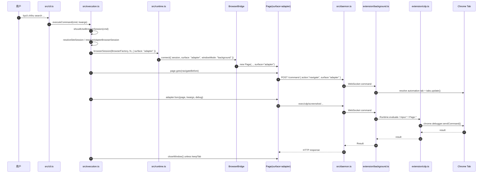
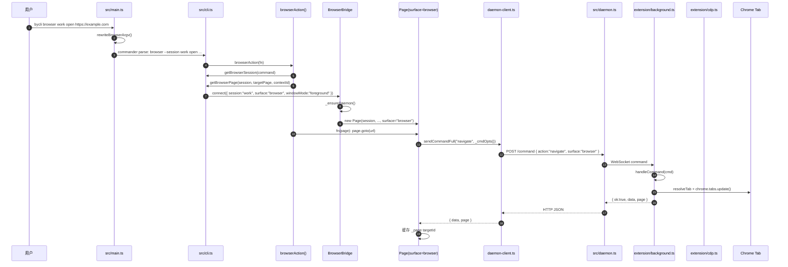
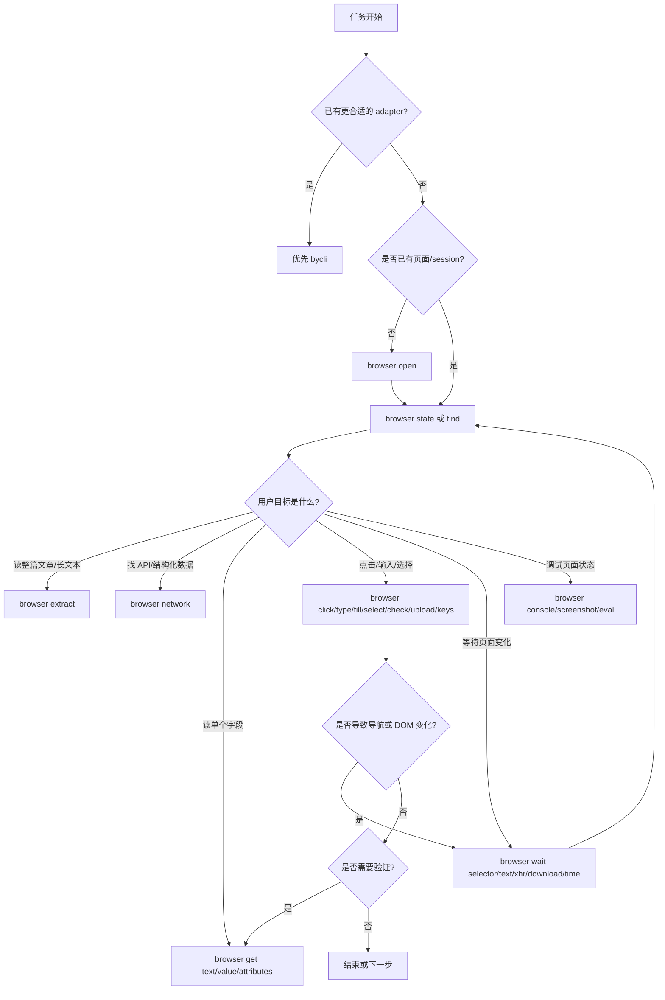
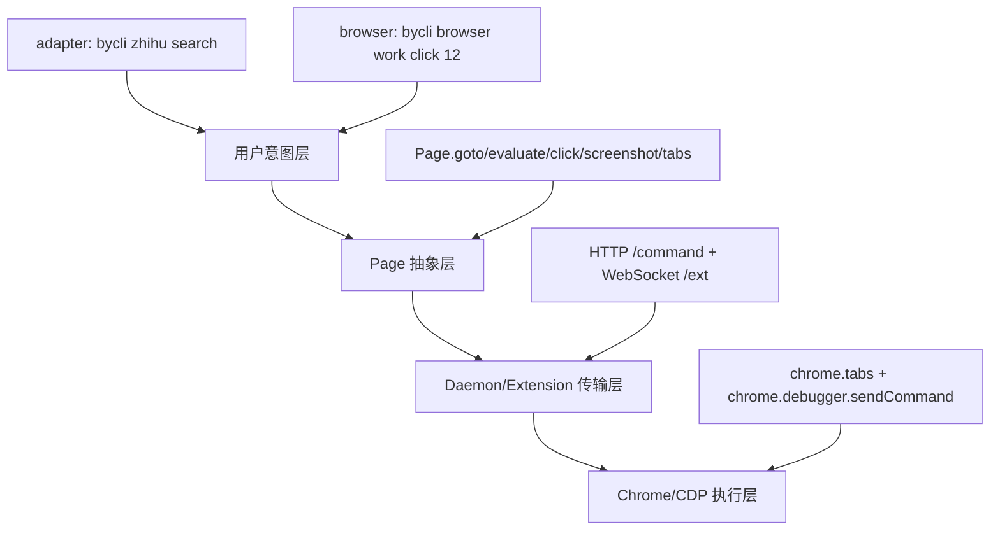

# byCLI Adapter 与 byCLI Browser 对比，以及 Browser 架构流程

本文从代码出发，对比 `bycli adapter` 和 `bycli browser` 的区别，并详细说明 `bycli browser` 如何从 CLI 命令一路走到 daemon、Chrome Extension、Chrome DevTools Protocol。

相关主文件：

| 文件 | 角色 |
|---|---|
| `src/cli.ts` | 定义 `bycli browser <session> ...` 命令族。 |
| `src/main.ts` | 把 `bycli browser <session> <command>` 改写成 commander 能解析的内部 `--session` 形式。 |
| `src/browser/bridge.ts` | `BrowserBridge`，负责连接 daemon 并创建 `Page`。 |
| `src/browser/page.ts` | daemon-backed `Page` 抽象，所有页面操作最终都发成 daemon command。 |
| `src/browser/daemon-client.ts` | CLI 侧 HTTP client，向 daemon `/command` 发送命令。 |
| `src/daemon.ts` | 本地 daemon，负责 HTTP 到 WebSocket 的转发。 |
| `extension/src/background.ts` | Chrome Extension 后台，接收命令并操作真实 tab。 |
| `extension/src/cdp.ts` | Chrome DevTools Protocol 执行层。 |
| `src/execution.ts` | adapter 命令执行入口，创建 `surface: 'adapter'` 的 browser session。 |

## 一句话区别

`bycli adapter` 是“网站专用命令”：用户调用 `bycli xueqiu hot`、`bycli zhihu search` 这种结构化命令，byCLI 自动决定是否开浏览器、是否预导航、如何执行 adapter 函数、如何释放 tab。

`bycli browser` 是“通用浏览器控制台”：用户直接调用 `bycli browser work open/click/state/eval/...`，用一个命名 session 连续操作同一个浏览器上下文。

两者底层大量共用：

```text
BrowserBridge
  -> Page
  -> daemon-client
  -> src/daemon.ts
  -> extension/src/background.ts
  -> extension/src/cdp.ts
  -> Chrome DevTools Protocol
```

真正把两者隔开的关键字段是 `surface`：

```ts
surface: 'browser' // bycli browser 命令
surface: 'adapter' // adapter 执行过程
```

Extension 会把 `session + surface` 组合成 lease key：

```ts
function getLeaseKey(session: string, surface: BrowserSurface): string {
  return `${surface}${LEASE_KEY_SEPARATOR}${encodeURIComponent(session)}`;
}
```

所以即使 session 名相同，`browser:work` 和 `adapter:work` 也是两组不同的 tab/window 资源。

## Adapter 与 Browser 对比表

| 维度 | bycli adapter | bycli browser |
|---|---|---|
| 用户入口 | `bycli <site> <command>` | `bycli browser <session> <command>` |
| 主要入口文件 | `src/execution.ts` | `src/cli.ts` |
| 命令目标 | 站点适配器，输出结构化结果 | 通用页面控制，输出页面状态或操作结果 |
| Page 创建位置 | `executeCommand()` 内部自动创建 | `browserAction()` 每次命令创建/连接 |
| surface | `adapter` | `browser` |
| session 名 | 默认 `site:<site>:<uuid>`，persistent 时 `site:<site>` | 用户显式传入，例如 `work`、`debug` |
| 默认窗口角色 | automation | interactive |
| 默认窗口模式 | background | foreground |
| 默认 idle timeout | 30 秒 | 10 分钟 |
| 生命周期 | 一次 adapter 命令结束后通常释放 lease | 用户命名 session 持续复用 |
| tab 释放 | `page.closeWindow()`，除非 `--keep-tab` 或 persistent | `bycli browser close` / `unbind` / idle timeout |
| 预导航 | 支持 `navigateBefore` / strategy 展开 | 用户显式 `open <url>` |
| 函数执行 | adapter 的 `func(page, kwargs, debug)` 或 pipeline | CLI 子命令调用 `Page` 方法 |
| 主要使用者 | 自动化命令、站点数据提取 | 人或 agent 的交互式浏览器操作 |

## 两条入口路径

### Adapter 路径



### Browser 路径



## bycli browser 的 CLI 层

`src/main.ts` 先处理 argv。原因是 commander 不适合同时处理父命令 positional 和子命令分发，所以代码把：

```bash
bycli browser work open https://example.com
```

改写成内部形式：

```bash
bycli browser --session work open https://example.com
```

关键代码位置：

```ts
// src/main.ts
const { rewriteBrowserArgv, BrowserSessionArgvError, escapeLeadingDashPositional } =
  await import('./cli-argv-preprocess.js');

let rewritten = rewriteBrowserArgv(process.argv.slice(2));
process.argv.splice(2, process.argv.length - 2, ...rewritten);
```

然后 `src/cli.ts` 定义 browser 命令组：

```ts
const browser = program
  .command('browser')
  .addOption(new Option('--session <name>', 'Internal ...').hideHelp())
  .option('--window <mode>', 'Browser window mode: foreground or background')
  .description('Browser control — navigate, click, type, extract, wait (no LLM needed)')
  .usage('<session> <command> [options]');
```

Browser 命令总表如下。这里按代码里的命令族分组；`最终常见 Page 方法` 是主路径，不代表唯一实现。

| 命令 | 作用 | 最终常见 Page 方法 / daemon action |
|---|---|---|
| `bind` | 把当前 Chrome 用户 tab 绑定到 browser session。 | `bindTab()` -> action `bind` |
| `unbind` | 解除 bound session，不关闭用户 tab。 | action `close-window` |
| `close` | 释放当前 browser session 的 tab lease。 | `page.closeWindow()` -> action `close-window` |
| `tab list` | 列出当前 browser session 内的 tab 和 targetId。 | `page.tabs()` -> action `tabs/list` |
| `tab new [url]` | 在 owned byCLI 窗口中新建 tab。 | `page.newTab()` -> action `tabs/new` |
| `tab select <targetId>` | 选择某个 targetId 作为默认 tab。 | `page.selectTab()` -> action `tabs/select` |
| `tab close [targetId]` | 关闭 session 内某个 tab。 | `page.closeTab()` -> action `tabs/close` |
| `open <url>` | 打开 URL，并启动网络捕获。 | `page.goto(url)` -> action `navigate` |
| `back` | 浏览器历史后退。 | `page.evaluate('history.back()')` -> action `exec` |
| `scroll <up/down>` | 页面滚动。 | `page.scroll()` -> action `exec` |
| `state` | 输出 URL、标题、可交互元素 refs。 | `page.snapshot()` -> action `exec` |
| `frames` | 列出 cross-origin iframe。 | `page.frames()` -> action `frames` |
| `screenshot [path]` | 截图，可 full page、annotate、指定 viewport。 | `page.screenshot()` -> action `screenshot` |
| `console` | 读取或 follow 浏览器 console 消息。 | `page.consoleMessages()` -> action `exec` |
| `analyze <url>` | 站点侦察：反爬、网络形态、SSR globals、最近 adapter。 | `page.goto()` + `network` + `evaluate` |
| `find` | 按 CSS 或语义 locator 查找 DOM 元素。 | `page.evaluate(buildFindJs(...))` -> action `exec` |
| `get title` | 读取页面标题。 | `page.evaluate('document.title')` -> action `exec` |
| `get url` | 读取当前 URL。 | `page.getCurrentUrl()` / `location.href` |
| `get text` | 读取元素文本。 | `resolveRef()` + `page.evaluate()` |
| `get value` | 读取 input/textarea 值。 | `resolveRef()` + `page.evaluate()` |
| `get html` | 读取页面或 selector 范围 HTML，也可输出 JSON tree。 | `page.evaluate()` |
| `get attributes` | 读取元素 attributes。 | `resolveRef()` + `page.evaluate()` |
| `click` | 点击元素，支持 ref/CSS/语义 locator。 | `page.click()`，常落到 native CDP click |
| `type` | 点击元素后键盘式输入文本。 | `page.typeText()` / `insertText` |
| `hover` | 鼠标移动到元素上。 | `page.hover()` / CDP mouse event |
| `focus` | 聚焦元素。 | `page.focus()` |
| `dblclick` | 双击元素。 | `page.dblClick()` / CDP mouse event |
| `check` | 确保 checkbox/radio/aria-checked 为 checked。 | `page.setChecked(..., true)` |
| `uncheck` | 确保 checkbox/aria-checked 为 unchecked。 | `page.setChecked(..., false)` |
| `upload` | 给 file input 附加本地文件。 | `page.uploadFiles()` -> action `set-file-input` |
| `drag` | 从一个元素拖拽到另一个元素。 | `page.drag()` / CDP mouse event |
| `fill` | 精确设置输入框/textarea/contenteditable 文本并校验。 | `page.fillText()` |
| `select` | 选择 `<select>` 下拉选项。 | `resolveRef()` + `page.evaluate(selectResolvedJs(...))` |
| `keys <key>` | 按键，例如 Enter、Escape、Tab、Control+a。 | `page.pressKey()` / CDP keyboard event |
| `dialog accept` | 接受当前 JavaScript alert/confirm/prompt。 | `page.handleJavaScriptDialog(true)` -> action `cdp` |
| `dialog dismiss` | 取消当前 JavaScript dialog。 | `page.handleJavaScriptDialog(false)` -> action `cdp` |
| `wait selector <css>` | 等待 selector 出现。 | `page.wait({ selector })` |
| `wait text <text>` | 等待文本出现。 | `page.wait({ text })` |
| `wait time <seconds>` | 等固定时间。 | `page.wait(seconds)` |
| `wait xhr <regex>` | 等待捕获到匹配 URL 的 XHR/fetch。 | `startNetworkCapture()` + `networkRequests()` |
| `wait download [pattern]` | 等待浏览器下载完成。 | `page.waitForDownload()` -> action `wait-download` |
| `eval <js>` | 在页面上下文执行 JS；可用 `--frame` 指定 iframe。 | `page.evaluate()` / `page.evaluateInFrame()` |
| `extract` | 抽取页面正文为 markdown，并按段落 chunk。 | `page.evaluate(buildExtractHtmlJs(...))` + 本地 HTML 转 markdown |
| `network` | 输出网络请求 shape preview，或按 key 取完整 body。 | `page.readNetworkCapture()` / JS interceptor |
| `init <site/command>` | 在 `~/.bycli/clis/` 生成 adapter 脚手架。 | 本地文件写入，不走 `Page` |
| `verify <site/command>` | 执行 adapter 并用 fixture 校验输出。 | 子进程执行 `bycli <site> <command>` |

## AI 怎么知道该用哪个 browser 子命令

AI 不是靠“猜命令名”来操作浏览器，而是靠三层信息做决策：

| 来源 | 在哪里 | 作用 |
|---|---|---|
| Skill 操作手册 | `skills/bycli-browser/SKILL.md` | 告诉 agent 常用流程：先 `state/find`，再 `click/type/get`，长文用 `extract`，API 数据用 `network`。 |
| CLI help/description | `src/cli.ts` 的 `.description()`、`.argument()`、`.option()` | 让 agent 知道每个命令的参数、输出形态和边界。 |
| 结构化输出 envelope | `src/cli.ts` / `src/browser/target-errors.ts` | 命令执行后返回 `matches_n`、`match_level`、`error.code`、`hint`、`candidates`，指导下一步。 |

核心规则在 `skills/bycli-browser/SKILL.md` 里写得很直接：

```text
Always inspect before you act.
Prefer numeric ref over CSS once you have it.
Read match_level after every write.
Use state -> action -> state after a page change.
Prefer network to screen-scraping.
```

所以 AI 的典型决策树是：



换成更实用的选择表：

| AI 当前意图 | 优先命令 | 为什么 |
|---|---|---|
| 不知道页面上有什么 | `state` | 给出 URL、标题、文本树、`[N]` refs、form compound 信息。 |
| 已经知道 CSS 或语义目标 | `find` | 比整页 `state` 更小，返回 matches、refs、attrs、visible。 |
| 想读长文/正文 | `extract` | 自动降噪转 markdown，支持 chunk 和 `next_start_char`。 |
| 想拿列表/表格/API 数据 | `network` | 比 DOM scraping 稳，能按 key 取完整 body。 |
| 想读一个元素文本 | `get text` | 小输出，带 `matches_n` 和 `match_level`。 |
| 想读输入框当前值 | `get value` | 用于验证 `type/fill/select` 是否成功。 |
| 想看 DOM 结构 | `get html --as json` | 结构化树，比 raw HTML 更适合 agent 解析。 |
| 想点击按钮/链接 | `click` | 支持 numeric ref、CSS、semantic locator，并返回匹配置信息。 |
| 想输入，保留键盘行为/触发 autocomplete | `type` | click 后模拟输入，适合搜索框、自动补全。 |
| 想精确设置输入值 | `fill` | 替换并校验，适合普通 input/textarea/contenteditable。 |
| 想操作原生下拉 | `select` | 只适合 `<select>`；自定义下拉用 `click -> state -> click option`。 |
| 想勾选/取消勾选 | `check` / `uncheck` | 比 blind click 更安全，因为目标状态明确。 |
| 想上传文件 | `upload` | 通过 CDP `DOM.setFileInputFiles` 设置本地文件路径。 |
| 想等待页面加载/API 返回 | `wait selector/text/xhr/download` | 避免刚点击完就读取旧 DOM。 |
| 想处理 alert/confirm/prompt | `dialog accept/dismiss` | 对应 JS dialog，不靠页面 DOM。 |
| 想调试 JS 计算值 | `eval` | 只读表达式；写操作优先用结构化命令。 |
| 想定位视觉/icon-only 控件 | `screenshot --annotate` | 把可见 refs 叠到图上，辅助选择目标。 |

更重要的是，命令输出会反过来教 AI 下一步怎么走。

例如 `click` / `get` 成功时会返回：

```json
{
  "clicked": true,
  "target": "12",
  "matches_n": 1,
  "match_level": "exact"
}
```

AI 看到 `matches_n: 1`、`match_level: "exact"`，就知道这次目标明确，可以继续。

失败时会返回结构化错误：

```json
{
  "error": {
    "code": "selector_ambiguous",
    "message": "Selector matched multiple elements.",
    "hint": "Pass --nth <n> or use a more specific selector.",
    "candidates": ["button.save", "button.save.primary"]
  }
}
```

AI 不需要猜；它按 `error.code` 分支：

| `error.code` | AI 下一步 |
|---|---|
| `not_found` / `stale_ref` | 重新 `state`，不要复用旧 ref。 |
| `selector_not_found` | 用更宽的 `find` 或重新 `state`。 |
| `selector_ambiguous` | 用 `--nth` 或 candidates 中更具体的 selector。 |
| `option_not_found` | 查看 `available`，再用真实 option label。 |
| `javascript_dialog_open` | 先 `dialog accept` 或 `dialog dismiss`。 |
| `xhr_not_seen` | 调整 regex、延长 timeout，或先看 `network`。 |

所以这个系统的设计重点不是让 AI 记住所有命令，而是让 AI 遵循一个闭环：

```text
观察 state/find/network/extract
  -> 选择最小必要命令
  -> 执行动作
  -> 读取结构化 envelope
  -> 按 matches_n / match_level / error.code 决定下一步
```

大部分 browser 子命令会包在 `browserAction()` 里：

```ts
function browserAction<Args extends unknown[]>(
  fn: (page: Awaited<ReturnType<typeof getBrowserPage>>, ...args: Args) => Promise<unknown>
) {
  return async (...args: Args) => {
    const command = args.at(-1) instanceof Command ? args.at(-1) as Command : undefined;
    const targetPage = getBrowserTargetId(command);
    const session = getBrowserSession(command);
    const contextId = getBrowserContextId(command);
    const windowMode = getBrowserWindowMode(command, 'foreground');

    const page = await getBrowserPage(session, targetPage, contextId, { windowMode });
    await fn(page, ...args);
  };
}
```

这个函数做了三件事：

1. 从 commander 上下文取出 session、profile、tab、window mode。
2. 调 `getBrowserPage()` 连接 Browser Bridge。
3. 统一处理连接错误、daemon 错误、目标元素错误、JS dialog 错误。

## getBrowserPage：browser session 如何变成 Page

`getBrowserPage()` 是 `bycli browser` 的 Page 创建入口：

```ts
async function getBrowserPage(
  session: string,
  targetPage?: string,
  contextId?: string,
  opts: { windowMode?: BrowserWindowMode } = {},
): Promise<IPage> {
  const { BrowserBridge } = await import('./browser/index.js');
  const bridge = new BrowserBridge();

  const page = await bridge.connect({
    timeout: 30,
    session,
    surface: 'browser',
    ...(contextId && { contextId }),
    windowMode: opts.windowMode ?? getBrowserWindowMode(undefined, 'foreground'),
  });

  const targetScope = getBrowserScope(session, contextId);
  const resolvedTargetPage = targetPage
    ? await resolveBrowserTargetInSession(page, targetPage, { scope: targetScope, source: 'explicit' })
    : await resolveStoredBrowserTarget(page, targetScope);

  if (resolvedTargetPage) page.setActivePage?.(resolvedTargetPage);
  return page;
}
```

关键点：

| 逻辑 | 说明 |
|---|---|
| `surface: 'browser'` | 决定 extension 走 interactive container。 |
| `windowMode: foreground` | browser 命令默认前台，适合人或 agent 看见页面。 |
| `session` 必填 | 同名 session 复用同一组 tab lease。 |
| `targetPage` / `--tab` | 可以把命令打到某个具体 targetId。 |
| stored target | `tab select` 后可以保存默认 tab，后续命令继续用。 |

## BrowserBridge：保证 daemon 和 extension 可用

`BrowserBridge.connect()` 的职责不是直接操作浏览器，而是保证这条通路可用：

```ts
async connect(opts = {}): Promise<IPage> {
  const contextId = opts.contextId ?? resolveProfileContextId();
  await this._ensureDaemon(opts.timeout, contextId);

  if (!opts.session?.trim()) throw new Error('Browser session is required');

  this._page = new Page(
    opts.session.trim(),
    opts.idleTimeout,
    contextId,
    opts.windowMode,
    opts.surface,
    opts.siteSession,
  );
  return this._page;
}
```

`_ensureDaemon()` 会处理这些情况：

| 状态 | 行为 |
|---|---|
| daemon 未启动 | `spawnDaemonProcess()` 启动 daemon。 |
| daemon 版本过旧 | 请求 `/shutdown`，等待端口释放，然后启动新 daemon。 |
| daemon 已启动但 extension 未连接 | 等待 extension 连接，超时后报错。 |
| 多个 Chrome profile 都连接 | 要求用户通过 `--profile` 或 profile 配置选择。 |
| 指定 profile 未连接 | 提示打开对应 Chrome profile 并启用 extension。 |
| ready | 直接返回。 |

所以 `bycli browser` 的用户体验是：第一次使用时自动拉起 daemon，后续命令复用 daemon 和 extension 连接。

## Page：所有 browser 操作都变成 command

`src/browser/page.ts` 是核心抽象。`Page` 不直接调用 Chrome API，而是把操作变成 daemon command。

构造函数里最关键的是 `surface`：

```ts
constructor(
  private readonly session: string,
  idleTimeout?: number,
  public readonly contextId?: string,
  private readonly windowMode?: 'foreground' | 'background',
  private readonly surface: 'browser' | 'adapter' = 'browser',
  private readonly siteSession?: 'ephemeral' | 'persistent',
) {}
```

发送命令时，`Page` 会把 session、surface、contextId、page targetId 统一塞进去：

```ts
private _cmdOpts(): Record<string, unknown> {
  return {
    session: this.session,
    surface: this.surface,
    ...(this.contextId && { contextId: this.contextId }),
    ...(this._page !== undefined && { page: this._page }),
    ...(this.windowMode && { windowMode: this.windowMode }),
    ...(this.siteSession && { siteSession: this.siteSession }),
  };
}
```

以 `open` 为例，CLI 子命令最后会调用 `page.goto(url)`：

```ts
async goto(url: string, options?: { waitUntil?: 'load' | 'none'; settleMs?: number }): Promise<void> {
  const result = await sendCommandFull('navigate', {
    url,
    ...this._cmdOpts(),
  });

  if (result.page) {
    this._page = result.page;
  }

  this._lastUrl = url;

  // 导航后注入 stealth，并等待 DOM 稳定。
  const combinedCode = `${generateStealthJs()};\n${waitForDomStableJs(...)}`;
  await sendCommand('exec', { code: combinedCode, ...this._cmdOpts() });
}
```

注意 `_page`：

| 字段 | 含义 |
|---|---|
| `_page` | Chrome targetId，不是 tabId。 |
| 来源 | extension 在 `pageScopedResult()` 里通过 `identity.resolveTargetId(tabId)` 返回。 |
| 作用 | 后续 `eval/click/screenshot/state` 精确打到同一个页面。 |
| 失效处理 | 如果 tab 被关，`goto()` 会识别 stale page identity，清空 `_page` 后重试。 |

## daemon-client：HTTP 命令封装

`src/browser/daemon-client.ts` 把 Page 操作发到本地 daemon：

```ts
async function sendCommandRaw(action, params): Promise<DaemonResult> {
  const id = generateId();
  const contextId = params.contextId ?? resolveProfileContextId();
  const command = { id, action, ...params, ...(contextId && { contextId }) };

  const res = await requestDaemon('/command', {
    method: 'POST',
    headers: { 'Content-Type': 'application/json' },
    body: JSON.stringify(command),
    timeout: 30000,
  });

  const result = await res.json() as DaemonResult;
  if (!result.ok) throw new BrowserCommandError(result.error, result.errorCode, result.errorHint);
  return result;
}
```

这里的重试策略也在 client 层：

| 错误 | 处理 |
|---|---|
| network error / abort | 最多重试 4 次。 |
| duplicate command id | 换 id 重试。 |
| 可重试浏览器错误 | 按 `classifyBrowserError()` 建议延迟重试。 |
| daemon 返回 `ok:false` | 抛 `BrowserCommandError`，带 `errorCode` / `errorHint`。 |

## daemon：HTTP 到 Extension WebSocket 的桥

`src/daemon.ts` 的架构注释已经写得很直接：

```text
CLI -> HTTP POST /command -> daemon -> WebSocket -> Extension
Extension -> WebSocket result -> daemon -> HTTP response -> CLI
```

daemon 主要维护两个状态：

```ts
const extensionProfiles = new Map<string, ExtensionProfileConnection>();
const pending = new Map<string, {
  contextId: string;
  action: string;
  dispatched: boolean;
  resolve: (data: unknown) => void;
  reject: (error: Error) => void;
  timer: ReturnType<typeof setTimeout>;
}>();
```

| 状态 | 作用 |
|---|---|
| `extensionProfiles` | 每个 Chrome profile/context 对应一个 extension WebSocket。 |
| `pending` | 每个 HTTP command 等待 extension 通过 WebSocket 回结果。 |

收到 `/command` 时：

```ts
if (req.method === 'POST' && url === '/command') {
  const body = JSON.parse(await readBody(req));
  const route = resolveExtensionConnection(body.contextId);

  const result = await new Promise((resolve, reject) => {
    pending.set(body.id, { contextId, action, resolve, reject, timer, dispatched: false });
    route.connection!.ws.send(JSON.stringify(body));
    entry.dispatched = true;
  });

  jsonResponse(res, 200, result);
}
```

Extension 连接 daemon 后会先发 hello：

```ts
if (msg.type === 'hello') {
  const connection = registerExtensionConnection(ws, msg.contextId);
  connection.extensionVersion = msg.version;
  connection.extensionCompatRange = msg.compatRange;
  return;
}
```

Extension 回命令结果时，daemon 用 `id` 找 pending request：

```ts
const p = pending.get(msg.id);
if (p) {
  clearTimeout(p.timer);
  pending.delete(msg.id);
  p.resolve(msg);
}
```

所以 daemon 本身不理解 `click`、`eval`、`tabs` 的业务含义。它只做：

1. profile/context 路由。
2. HTTP/WS 协议转换。
3. pending 请求匹配。
4. 超时、断连、版本和安全检查。

## Extension：surface 如何决定窗口和 lease

Extension 收到 command 后进入 `handleCommand(cmd)`：

```ts
async function handleCommand(cmd: Command): Promise<Result> {
  const session = getSessionName(cmd.session);
  const surface = getCommandSurface(cmd);
  const leaseKey = getLeaseKey(session, surface);

  if (cmd.windowMode === 'foreground' || cmd.windowMode === 'background') {
    sessionWindowModeOverrides.set(leaseKey, cmd.windowMode);
  }

  if (surface === 'adapter' && (cmd.siteSession === 'persistent' || cmd.siteSession === 'ephemeral')) {
    sessionLifecycleOverrides.set(leaseKey, cmd.siteSession);
  }

  resetWindowIdleTimer(leaseKey);

  switch (cmd.action) {
    case 'exec': return await handleExec(cmd, leaseKey);
    case 'navigate': return await handleNavigate(cmd, leaseKey);
    case 'tabs': return await handleTabs(cmd, leaseKey);
    case 'bind': return await handleBind(cmd, leaseKey);
    case 'close-window': return await handleCloseWindow(cmd, leaseKey);
    // screenshot / cdp / cookies / frames / download / network...
  }
}
```

`surface` 影响三组核心策略：

```ts
function getIdleTimeout(key: string): number {
  if (session?.kind === 'bound') return IDLE_TIMEOUT_NONE;
  if (adapterPersistent) return IDLE_TIMEOUT_NONE;
  return getSurfaceFromKey(key) === 'browser'
    ? IDLE_TIMEOUT_INTERACTIVE
    : IDLE_TIMEOUT_DEFAULT;
}

function getLeaseLifecycle(key: string, kind: LeaseKind): LeaseLifecycle {
  if (kind === 'bound') return 'pinned';
  return getSurfaceFromKey(key) === 'browser' ? 'persistent' : 'ephemeral';
}

function getOwnedWindowRole(key: string): OwnedWindowRole {
  return getSurfaceFromKey(key) === 'browser' ? 'interactive' : 'automation';
}
```

对应结果：

| surface | window role | group title | idle timeout | lifecycle |
|---|---|---|---|---|
| `browser` | `interactive` | `byCLI Browser` | 10 分钟 | persistent |
| `adapter` | `automation` | `byCLI Adapter` | 30 秒 | ephemeral，除非 siteSession persistent |
| bound tab | `borrowed-user` | 用户原窗口 | 不自动过期 | pinned |

## owned session 与 bound session

`bycli browser` 有两种工作模式。

### owned session

默认 `bycli browser work open https://example.com` 会让 extension 创建或复用 byCLI 自己管理的窗口/tab。

关键流程：

```text
handleNavigate()
  -> resolveCommandTabId(cmd.page)
  -> resolveTab(cmdTabId, leaseKey, cmd.url)
  -> createOwnedTabLease() / getAutomationWindow()
  -> chrome.tabs.update(tabId, { url })
  -> pageScopedResult(id, tabId, data)
```

owned session 的 tab 可以被 `tab new/select/close` 修改，因为这些 tab 属于 byCLI。

### bound session

`bycli browser work bind` 会把当前 Chrome 用户 tab 绑定给 session。

关键代码：

```ts
async function handleBind(cmd: Command, leaseKey: string): Promise<Result> {
  const activeTabs = await chrome.tabs.query({ active: true, lastFocusedWindow: true });
  const fallbackTabs = await chrome.tabs.query({ lastFocusedWindow: true });
  const boundTab = activeTabs.find((tab) => isDebuggableUrl(tab.url))
    ?? fallbackTabs.find((tab) => isDebuggableUrl(tab.url));

  setLeaseSession(leaseKey, {
    session: getSessionFromKey(leaseKey),
    surface: getSurfaceFromKey(leaseKey),
    kind: 'bound',
    windowId: boundTab.windowId,
    owned: false,
    preferredTabId: boundTab.id,
  });

  return pageScopedResult(cmd.id, boundTab.id, { url: boundTab.url, title: boundTab.title });
}
```

bound session 的意义是：不创建 byCLI 专用窗口，而是直接操作用户当前打开的 tab。为了安全，bound tab 禁止大部分 tab mutation：

```ts
async function handleTabs(cmd: Command, leaseKey: string): Promise<Result> {
  const session = automationSessions.get(leaseKey);
  if (session && !session.owned && cmd.op !== 'list') {
    return {
      id: cmd.id,
      ok: false,
      errorCode: 'bound_tab_mutation_blocked',
      error: 'Session is bound to a user tab; tab new/select/close requires an owned byCLI session.',
    };
  }
}
```

这就是为什么绑定用户 tab 后，`tab list` 可以，但 `tab new/select/close` 会被拒绝。

## bycli browser open 的完整调用链

以命令为例：

```bash
bycli browser work open https://example.com
```

完整链路：

```text
src/main.ts
  rewriteBrowserArgv()
    bycli browser work open ...
    -> bycli browser --session work open ...

src/cli.ts
  browser.command('open')
  -> browserAction(async page => page.goto(url))
  -> getBrowserPage('work')

src/browser/bridge.ts
  BrowserBridge.connect({ session:'work', surface:'browser' })
  -> _ensureDaemon()
  -> new Page(... surface:'browser')

src/browser/page.ts
  Page.goto(url)
  -> sendCommandFull('navigate', { url, session:'work', surface:'browser', contextId })

src/browser/daemon-client.ts
  POST http://127.0.0.1:19825/command

src/daemon.ts
  resolveExtensionConnection(contextId)
  -> pending.set(id, ...)
  -> ws.send(command)

extension/src/background.ts
  handleCommand(cmd)
  -> getLeaseKey('work', 'browser')
  -> handleNavigate(cmd, leaseKey)
  -> resolveTab(..., leaseKey, url)
  -> chrome.tabs.update(tabId, { url })
  -> pageScopedResult(id, tabId, data)

extension/src/identity.ts
  tabId -> targetId

src/daemon.ts
  pending.get(result.id).resolve(result)

src/browser/page.ts
  result.page -> this._page
```

后续命令：

```bash
bycli browser work state
bycli browser work click 12
bycli browser work eval "document.title"
```

会继续带上同一个 `session: "work"`，并且如果已选中具体 tab，会带上 `page: "<targetId>"`。

## bycli browser click 的典型调用链

`click` 不是 daemon 的 action。它是 CLI 层的高级命令，最终会拆成 `exec` 或 `cdp`。

```text
bycli browser work click 12
  -> browserAction()
  -> getBrowserPage()
  -> page.click("12")
  -> BasePage 解析 ref
  -> Page.evaluate(resolveTargetJs(...))       // action: exec
  -> Page.cdp("Input.dispatchMouseEvent", ...) // action: cdp，native click
  -> extension handleExec / handleCdp
  -> cdp.ts ensureAttached()
  -> chrome.debugger.sendCommand()
```

这里要区分两层命令：

| 层级 | 例子 | 谁处理 |
|---|---|---|
| 用户 CLI 命令 | `bycli browser work click 12` | `src/cli.ts` + `BasePage` |
| daemon action | `exec` / `cdp` | `extension/src/background.ts` |

也就是说，extension 不知道“click 12”这个用户意图。它只收到更底层的：

```json
{
  "action": "exec",
  "code": "...resolve target..."
}
```

或：

```json
{
  "action": "cdp",
  "cdpMethod": "Input.dispatchMouseEvent",
  "cdpParams": {
    "type": "mousePressed",
    "x": 120,
    "y": 240
  }
}
```

## adapter 如何复用 browser 架构

Adapter 并没有另一套浏览器执行引擎。`src/execution.ts` 在发现 command 需要 browser 时，也调用同一套 `browserSession()`：

```ts
result = await browserSession(BrowserFactory, async (page) => {
  const preNavUrl = resolvePreNav(cmd);
  if (preNavUrl) {
    await page.goto(preNavUrl);
  }

  const result = await runWithTimeout(runCommand(cmd, page, kwargs, debug), {
    timeout: browserTimeout,
    label: fullName(cmd),
  });

  if (!keepTab) await page.closeWindow?.().catch(() => {});
  return result;
}, {
  session,
  cdpEndpoint,
  contextId,
  windowMode,
  surface: 'adapter',
  siteSession,
});
```

adapter 与 browser 的关键差异不是 Page 能力，而是“谁驱动 Page”：

| 项 | adapter | browser |
|---|---|---|
| Page 的调用者 | adapter 函数 / pipeline | browser 子命令 |
| session 生成 | runtime 自动生成 | 用户命名 |
| 是否预导航 | runtime 根据 adapter metadata 自动做 | 用户显式 `open` |
| 是否结束释放 | 默认释放 | 默认保留 |
| 输出 | adapter 自己格式化的数据 | browser 命令自己的状态/操作结果 |

## 心智模型

可以把 byCLI 的浏览器层理解成三层：



其中：

| 层 | adapter 视角 | browser 视角 |
|---|---|---|
| 用户意图层 | 站点命令 | 浏览器操作命令 |
| Page 抽象层 | adapter 拿到 `page` 后调用方法 | CLI 子命令内部调用 `page` 方法 |
| 传输层 | 完全相同 | 完全相同 |
| Chrome/CDP 层 | 完全相同 | 完全相同 |

最终可以用一句话记住：

```text
bycli adapter 是把“站点能力”包装成 CLI；
bycli browser 是把“浏览器本身”包装成 CLI；
两者底层共用 BrowserBridge/Page/daemon/extension/CDP，只是 surface、session 生命周期和调用者不同。
```
