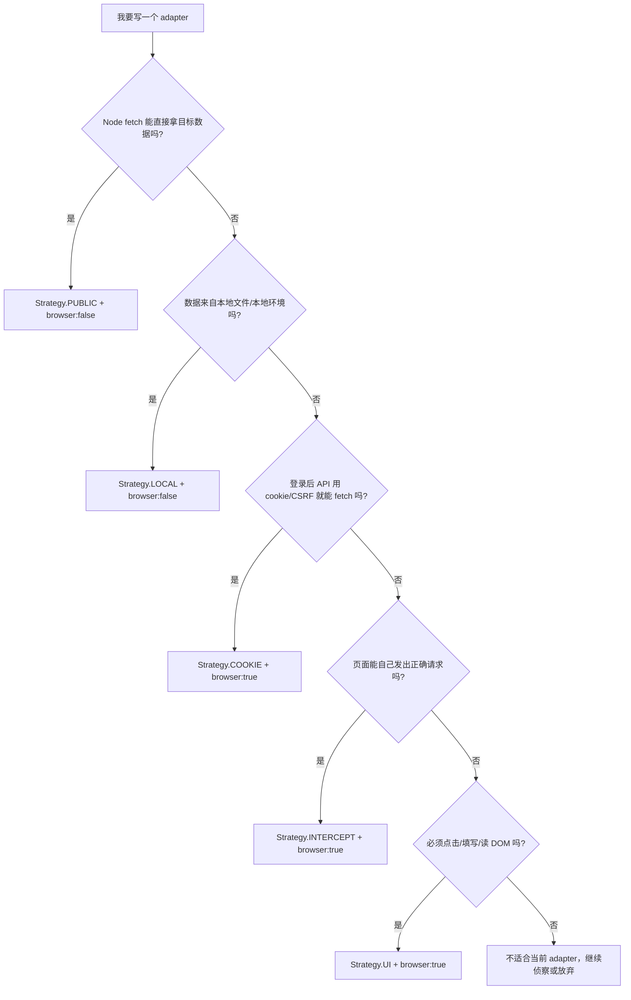

# cli() 中 Strategy 参数的作用与实现原理

本文解释 adapter 里这段代码的 `strategy` 到底有什么用：

```js
import { cli, Strategy } from '@sovovs/bycli/registry';

cli({
  site: 'bbc',
  name: 'news',
  strategy: Strategy.PUBLIC,
  browser: false,
  // ...
});
```

先给结论：

```text
Strategy 不是具体执行代码。
Strategy 是 adapter 的“能力声明”和“默认运行策略”。

它会在注册阶段被 normalizeCommand() 翻译成：
  1. cmd.browser          是否需要 Page / BrowserBridge / daemon / extension
  2. cmd.navigateBefore   执行 adapter 前是否需要预导航

后续 execution.ts 主要看 browser / navigateBefore，不直接根据 strategy 分支执行。
```

## Strategy 有哪些值

定义在 `src/registry.ts`：

```ts
export enum Strategy {
  PUBLIC = 'public',
  LOCAL = 'local',
  COOKIE = 'cookie',
  INTERCEPT = 'intercept',
  UI = 'ui',
}
```

含义如下：

| Strategy | 适合场景 | 默认是否需要 browser | 典型 func 签名 |
|---|---|---:|---|
| `Strategy.PUBLIC` | 公开 API / RSS / 静态网页，Node `fetch()` 能直接拿到数据。 | 否 | `func(kwargs)` |
| `Strategy.LOCAL` | 本地数据、文件、离线命令，不需要远程站点和浏览器。 | 否 | `func(kwargs)` |
| `Strategy.COOKIE` | 需要登录态 cookie、CSRF、WAF 通过真实浏览器上下文。 | 是 | `func(page, kwargs)` |
| `Strategy.INTERCEPT` | 页面自己会发签名请求，adapter 通过拦截请求/响应拿数据。 | 是 | `func(page, kwargs)` |
| `Strategy.UI` | 必须操作真实 UI，比如点按钮、读 SPA DOM、发消息、点赞。 | 是 | `func(page, kwargs)` |

## 它和 browser 字段的关系

`strategy` 和 `browser` 经常一起出现，但不是同一个东西。

| 字段 | 作用 |
|---|---|
| `strategy` | 声明这个 adapter 的能力/鉴权/数据获取策略。 |
| `browser` | 决定运行时是否传入 `page` 对象。 |

例如：

```js
cli({
  strategy: Strategy.COOKIE,
  browser: true,
  func: async (page, kwargs) => {
    // 有 page
  },
});
```

如果 `browser: true`，adapter 的 `func` 会收到 `page`：

```ts
func(page, kwargs, debug)
```

如果 `browser: false`，adapter 的 `func` 不会收到 `page`：

```ts
func(kwargs, debug)
```

这个区别很重要。`skills/bycli-adapter-author/SKILL.md` 里也特别强调：

```text
browser:false -> (args)
browser:true  -> (page, args)
```

写错后，`kwargs` 会错位，adapter 可能悄悄用默认参数跑，造成 silent bug。

## 最关键代码：normalizeCommand()

`Strategy` 真正起作用的地方在 `src/registry.ts` 的 `normalizeCommand()`。

关键代码摘录：

```ts
function normalizeCommand(cmd: RawCliCommand): CliCommand {
  assertCommandAccess(cmd);
  assertSiteSession(cmd);

  const strategy = cmd.strategy ?? (cmd.browser === false ? Strategy.PUBLIC : Strategy.COOKIE);
  const browser = cmd.browser ?? (strategy !== Strategy.PUBLIC && strategy !== Strategy.LOCAL);

  let navigateBefore = cmd.navigateBefore;
  if (navigateBefore === undefined) {
    if (strategy === Strategy.COOKIE && cmd.domain) {
      navigateBefore = `https://${cmd.domain}`;
    } else if (strategy !== Strategy.PUBLIC && strategy !== Strategy.LOCAL) {
      navigateBefore = true;
    }
  }

  return browser
    ? { ...cmd, strategy, browser: true, navigateBefore } as BrowserCliCommand
    : { ...cmd, strategy, browser: false, navigateBefore } as NonBrowserCliCommand;
}
```

逐行解释：

| 代码 | 含义 |
|---|---|
| `cmd.strategy ?? ...` | 如果没写 strategy，就根据 `browser` 猜默认值。 |
| `cmd.browser ?? ...` | 如果没写 browser，就根据 strategy 推导是否需要浏览器。 |
| `Strategy.PUBLIC / LOCAL` | 默认不需要 browser。 |
| `Strategy.COOKIE / INTERCEPT / UI` | 默认需要 browser。 |
| `COOKIE + domain` | 自动生成 `navigateBefore = https://<domain>`。 |
| 非 PUBLIC/LOCAL 但不是 COOKIE+domain | 设置 `navigateBefore = true`，表示需要浏览器上下文，但不指定预导航 URL。 |
| 最后 return | 把 raw command 变成 BrowserCliCommand 或 NonBrowserCliCommand。 |

所以 Strategy 的第一层作用是：

```text
Strategy -> browser / navigateBefore
```

## navigateBefore 是什么

`navigateBefore` 是执行 adapter 前的预导航意图。

它有几种值：

| 值 | 意义 |
|---|---|
| `undefined` | 不预导航。 |
| `false` | 明确不要预导航，即使 strategy/domain 看起来可以推导。 |
| `true` | 需要 browser session，但没有指定 URL。 |
| 字符串 URL | adapter 执行前先 `page.goto(URL)`。 |

`Strategy.COOKIE + domain` 会自动生成 URL：

```ts
if (strategy === Strategy.COOKIE && cmd.domain) {
  navigateBefore = `https://${cmd.domain}`;
}
```

例子：

```js
cli({
  site: 'bilibili',
  name: 'search',
  domain: 'www.bilibili.com',
  strategy: Strategy.COOKIE,
});
```

注册后大概会变成：

```ts
{
  strategy: 'cookie',
  browser: true,
  navigateBefore: 'https://www.bilibili.com',
}
```

执行时，`src/execution.ts` 会先做预导航：

```ts
const preNavUrl = resolvePreNav(cmd);
if (preNavUrl && await shouldRunPreNav(cmd, page, siteSession, preNavUrl)) {
  await page.goto(preNavUrl);
}
```

`resolvePreNav()` 的代码：

```ts
function resolvePreNav(cmd: CliCommand): string | null {
  if (cmd.navigateBefore === false) return null;
  if (typeof cmd.navigateBefore === 'string') return cmd.navigateBefore;
  return null;
}
```

注意：`navigateBefore: true` 不会变成 URL，它只是告诉系统“这个命令需要 browser context”。真正去哪一页，由 adapter 自己 `page.goto()`。

## execution.ts 如何使用 browser / navigateBefore

运行 adapter 时，`src/execution.ts` 先判断是否需要 browser：

```ts
if (shouldUseBrowserSession(cmd)) {
  const BrowserFactory = getBrowserFactory(cmd.site);
  const contextId = resolveProfileContextId(opts.profile);
  const siteSession = resolveSiteSession(cmd, opts.siteSession);
  const session = resolveAdapterBrowserSession(cmd, siteSession);
  const windowMode = resolveBrowserWindowMode('background', opts.windowMode);

  result = await browserSession(BrowserFactory, async (page) => {
    const preNavUrl = resolvePreNav(cmd);
    if (preNavUrl && await shouldRunPreNav(cmd, page, siteSession, preNavUrl)) {
      await page.goto(preNavUrl);
    }

    return await runCommand(cmd, page, kwargs, debug);
  }, { session, contextId, windowMode, surface: 'adapter', siteSession });
}
```

是否需要 browser 的判断在 `src/capabilityRouting.ts`：

```ts
export function shouldUseBrowserSession(cmd: CliCommand): boolean {
  if (!cmd.browser) return false;
  if (cmd.func) return true;
  if (!cmd.pipeline || cmd.pipeline.length === 0) return true;
  if (cmd.navigateBefore) return true;
  return pipelineNeedsBrowserSession(cmd.pipeline as Record<string, unknown>[]);
}
```

这说明：

```text
strategy 本身不直接决定 execution 分支；
strategy 先在 registry 阶段变成 cmd.browser / cmd.navigateBefore；
execution 再根据这些字段决定是否创建 browser session。
```

## cli() 注册时发生了什么

adapter 调用：

```js
cli({
  site: 'bbc',
  name: 'news',
  strategy: Strategy.PUBLIC,
  browser: false,
  // ...
});
```

进入 `src/registry.ts`：

```ts
export function cli(opts: CliOptions): CliCommand {
  const cmd: RawCliCommand = {
    site: opts.site,
    name: opts.name,
    access: opts.access,
    description: opts.description ?? '',
    domain: opts.domain,
    strategy: opts.strategy,
    browser: opts.browser,
    args: opts.args ?? [],
    columns: opts.columns,
    func: opts.func,
    pipeline: opts.pipeline,
    navigateBefore: opts.navigateBefore,
    siteSession: opts.siteSession,
  };

  registerCommand(cmd);
  return _registry.get(fullName(cmd))!;
}
```

`registerCommand()` 调 `normalizeCommand()`：

```ts
export function registerCommand(cmd: RawCliCommand): void {
  const normalized = normalizeCommand(cmd);
  const canonicalKey = fullName(normalized);
  _registry.set(canonicalKey, normalized);
}
```

注册完成后，byCLI registry 里保存的是“归一化之后”的命令。

## 五种 Strategy 详细说明

### Strategy.PUBLIC

适合公开数据源，Node 侧可以直接 `fetch()`。

真实例子：`clis/bbc/news.js`

```js
cli({
  site: 'bbc',
  name: 'news',
  access: 'read',
  description: 'BBC News headlines (RSS)',
  domain: 'www.bbc.com',
  strategy: Strategy.PUBLIC,
  args: [
    { name: 'limit', type: 'int', default: 20, help: 'Number of headlines (max 50)' },
  ],
  columns: ['rank', 'title', 'description', 'url'],
  func: async (kwargs) => {
    const resp = await fetch('https://feeds.bbci.co.uk/news/rss.xml');
    const xml = await resp.text();
    return parseItems(xml);
  },
});
```

注册结果：

```ts
strategy = 'public'
browser = false
navigateBefore = undefined
```

运行效果：

```text
不会启动 BrowserBridge
不会连接 daemon
不会打开 Chrome tab
func(kwargs) 直接在 Node 里跑
```

适合：

| 场景 | 例子 |
|---|---|
| 公开 REST API | CoinGecko、OSV、NVD |
| RSS / XML | BBC RSS |
| 静态 HTML 可直接 fetch | 简单公开列表页 |

### Strategy.LOCAL

适合本地数据或本地计算，不需要浏览器，也不一定需要远程站点。

注册结果：

```ts
strategy = 'local'
browser = false
navigateBefore = undefined
```

和 `PUBLIC` 的运行行为很像：都不会创建 browser session。区别更多是语义：

| Strategy | 语义 |
|---|---|
| `PUBLIC` | 远程公开数据，不需要登录。 |
| `LOCAL` | 本地数据/文件/本地环境，不强调远程公开访问。 |

### Strategy.COOKIE

适合需要登录态或浏览器 cookie 的站点。

真实例子：`clis/51job/search.js`

```js
cli({
  site: '51job',
  name: 'search',
  access: 'read',
  description: '51job 前程无忧关键词职位搜索',
  domain: 'we.51job.com',
  strategy: Strategy.COOKIE,
  browser: true,
  navigateBefore: false,
  args: [
    { name: 'keyword', required: true, positional: true },
  ],
  func: async (page, kwargs) => {
    const currentUrl = await page.evaluate(`(() => window.location.href)()`);
    if (!String(currentUrl).startsWith(WE_ORIGIN)) {
      await navigateTo(page, `${WE_ORIGIN}/pc/search?...`, 2);
    }

    const data = await pageFetchJson(page, url);
    return data.resultbody.job.items.map(mapJobItem);
  },
});
```

这里有两个点：

1. `Strategy.COOKIE` 说明它需要浏览器上下文/cookie。
2. `navigateBefore: false` 覆盖默认预导航，因为 adapter 自己要做更精细的 WAF-clean 导航。

如果没有写 `navigateBefore: false`，并且有 `domain`：

```ts
strategy === Strategy.COOKIE && cmd.domain
```

默认会预导航到：

```text
https://we.51job.com
```

适合：

| 场景 | 做法 |
|---|---|
| API 需要登录 cookie | `page.evaluate(() => fetch(..., { credentials: 'include' }))` |
| Node fetch 被 WAF 拦截 | 在真实 browser tab 里 fetch。 |
| 需要先打开站点拿 cookie / localStorage / csrf | `COOKIE + browser:true`。 |

### Strategy.INTERCEPT

适合“页面自己能发请求，但 adapter 很难独立构造请求”的情况。

常见原因：

| 原因 | 说明 |
|---|---|
| 请求有签名 | 页面 JS 生成签名，adapter 不想逆向。 |
| 请求参数复杂 | SPA 内部状态决定参数。 |
| GraphQL payload 很复杂 | 点击/导航后页面自己发正确请求。 |
| 独立 fetch 被拦 | 让页面自己发，adapter 只拦截响应。 |

真实例子：`clis/twitter/notifications.js`

```js
cli({
  site: 'twitter',
  name: 'notifications',
  access: 'read',
  domain: 'x.com',
  strategy: Strategy.INTERCEPT,
  browser: true,
  func: async (page, kwargs) => {
    await page.goto('https://x.com/home');
    await page.wait(3);

    await page.installInterceptor('NotificationsTimeline');

    await page.evaluate(`() => {
      window.history.pushState({}, '', '/notifications');
      window.dispatchEvent(new PopStateEvent('popstate', { state: {} }));
    }`);

    await page.waitForCapture(5);
    const requests = await page.getInterceptedRequests();
    return parseNotifications(requests);
  },
});
```

底层 Page 方法在 `src/browser/base-page.ts`：

```ts
async installInterceptor(pattern: string): Promise<void> {
  const { generateInterceptorJs } = await import('../interceptor.js');
  await this.evaluate(generateInterceptorJs(JSON.stringify(pattern), {
    arrayName: '__bycli_xhr',
    patchGuard: '__bycli_interceptor_patched',
  }));
}

async getInterceptedRequests(): Promise<unknown[]> {
  const { generateReadInterceptedJs } = await import('../interceptor.js');
  const result = await this.evaluate(generateReadInterceptedJs('__bycli_xhr'));
  return Array.isArray(result) ? result : [];
}

async waitForCapture(timeout: number = 10): Promise<void> {
  const maxMs = timeout * 1000;
  await this.evaluate(waitForCaptureJs(maxMs));
}
```

注册结果：

```ts
strategy = 'intercept'
browser = true
navigateBefore = true
```

注意：`INTERCEPT` 默认不会自动预导航到 `domain`。它只是说明需要 browser context。具体触发哪个页面、哪个点击、哪个 SPA route，通常由 adapter 自己控制。

### Strategy.UI

适合必须操作 UI 的场景：读 DOM、点击按钮、发消息、点赞、关注、发布等。

真实例子：`clis/discord-app/read.js`

```js
cli({
  site: 'discord-app',
  name: 'read',
  access: 'read',
  description: 'Read recent messages from the active Discord channel',
  domain: 'localhost',
  strategy: Strategy.UI,
  browser: true,
  args: [
    { name: 'count', default: '20' },
  ],
  columns: ['Author', 'Time', 'Message'],
  func: async (page, kwargs) => {
    const messages = await page.evaluate(`
      (function(limit) {
        const results = [];
        const msgNodes = document.querySelectorAll('[id^="chat-messages-"] > div, [class*="messageListItem"]');
        // parse rendered DOM...
        return results;
      })(${count})
    `);
    return messages;
  },
});
```

适合：

| 场景 | 为什么用 UI |
|---|---|
| 没有稳定 API | 只能从 DOM 读。 |
| 写操作必须经过页面 JS | 例如发消息、点赞、提交表单。 |
| 页面内部状态复杂 | 用浏览器里的真实状态最稳。 |

## TypeScript 类型层面的限制

`src/registry.ts` 不只在运行时 normalize，也在类型上限制 strategy 与 browser 的组合。

关键代码：

```ts
type BrowserStrategy = Exclude<Strategy, Strategy.PUBLIC | Strategy.LOCAL>;

type BrowserCliOptions =
  Partial<Omit<BrowserCliCommand, 'args' | 'description' | 'browser' | 'strategy'>>
  & RequiredCliOptions
  & (
    | { browser: true; strategy?: Strategy }
    | { browser?: true; strategy?: BrowserStrategy }
  );

type NonBrowserCliOptions =
  Partial<Omit<NonBrowserCliCommand, 'args' | 'description'>>
  & RequiredCliOptions
  & (
    | { browser: false }
    | { strategy: Strategy.PUBLIC | Strategy.LOCAL; browser?: false }
  );
```

意思是：

| 写法 | 类型意图 |
|---|---|
| `strategy: PUBLIC/LOCAL` | 可以是 non-browser。 |
| `strategy: COOKIE/INTERCEPT/UI` | 默认应该是 browser command。 |
| `browser: true` | 明确需要 `page`，允许任意 strategy，但作者要对语义负责。 |
| `browser: false` | 明确不需要 `page`。 |

真实 JS adapter 没有 TS 编译保护时，更要靠 review 和 `verify` 抓错。

## 测试里如何验证 Strategy 行为

`src/registry.test.ts` 直接验证了 normalize 行为：

```ts
it('COOKIE + domain -> navigateBefore is the domain URL', () => {
  registerCommand({
    site: 'test-norm',
    name: 'cookie-domain',
    access: 'read',
    description: '',
    args: [],
    strategy: Strategy.COOKIE,
    domain: 'x.com',
  });
  const cmd = getRegistry().get('test-norm/cookie-domain')!;
  expect(cmd.browser).toBe(true);
  expect(cmd.navigateBefore).toBe('https://x.com');
});

it('INTERCEPT -> navigateBefore is true (auth context)', () => {
  registerCommand({
    site: 'test-norm',
    name: 'intercept',
    access: 'read',
    description: '',
    args: [],
    strategy: Strategy.INTERCEPT,
    domain: 'example.com',
  });
  const cmd = getRegistry().get('test-norm/intercept')!;
  expect(cmd.browser).toBe(true);
  expect(cmd.navigateBefore).toBe(true);
});

it('PUBLIC -> browser false, navigateBefore undefined', () => {
  registerCommand({
    site: 'test-norm',
    name: 'public',
    access: 'read',
    description: '',
    args: [],
    strategy: Strategy.PUBLIC,
  });
  const cmd = getRegistry().get('test-norm/public')!;
  expect(cmd.browser).toBe(false);
  expect(cmd.navigateBefore).toBeUndefined();
});
```

这些测试正好说明 Strategy 的核心作用：不是执行数据抓取，而是决定默认运行形态。

## Strategy 和 bycli list/help

`strategy` 也会作为元数据展示给用户和 agent。

`src/registry.ts`：

```ts
export function strategyLabel(cmd: CliCommand): string {
  return cmd.strategy ?? Strategy.PUBLIC;
}
```

`src/cli.ts` 的 `bycli list` 会输出：

```ts
commands.map(c => ({
  command: fullName(c),
  site: c.site,
  name: c.name,
  description: c.description,
  access: c.access,
  strategy: strategyLabel(c),
  browser: !!c.browser,
  args: formatArgSummary(c.args),
}));
```

所以当你看到：

```text
strategy: cookie
browser: true
```

它告诉 agent：

```text
这个命令大概率依赖真实浏览器登录态。
失败时优先检查 bycli doctor / Chrome 登录态 / cookie，而不是先猜 API 失效。
```

## Strategy 和 access 的区别

不要混淆 `strategy` 和 `access`。

| 字段 | 问题 | 例子 |
|---|---|---|
| `strategy` | 我怎么拿数据/操作站点？ | public / cookie / intercept / ui |
| `access` | 这个命令是否会改变远端状态？ | read / write |

例如：

```js
cli({
  strategy: Strategy.COOKIE,
  access: 'read',
});
```

表示：

```text
需要登录态 cookie，但只是读取数据。
```

而：

```js
cli({
  strategy: Strategy.UI,
  access: 'write',
});
```

表示：

```text
需要操作 UI，并且会改变远端状态，例如发消息/点赞/关注。
```

## 如何选择 Strategy

可以按这个顺序判断：



选择表：

| 你看到的情况 | 建议 |
|---|---|
| 公开 API，curl 能拿 JSON | `Strategy.PUBLIC` |
| RSS/XML/公开 HTML 可直接 fetch | `Strategy.PUBLIC` |
| 读本地文件或本机状态 | `Strategy.LOCAL` |
| 需要登录 cookie，但 browser 里 fetch API 可用 | `Strategy.COOKIE` |
| 需要 CSRF/token，但 token 能从页面读到 | `Strategy.COOKIE` |
| 请求签名很复杂，页面自己会发 | `Strategy.INTERCEPT` |
| GraphQL payload 很难手写，但点击页面会发 | `Strategy.INTERCEPT` |
| 只能从渲染后的 DOM 读 | `Strategy.UI` |
| 必须点击按钮、输入、发布、点赞 | `Strategy.UI`，并且通常 `access:'write'` |

## 常见误区

### 误区 1：Strategy.COOKIE 会自动帮你取 cookie

不会。

`Strategy.COOKIE` 只会让命令默认需要 browser，并可能预导航到 domain。真正怎么用 cookie，要你在 adapter 里写：

```js
const data = await page.evaluate(async (url) => {
  const res = await fetch(url, { credentials: 'include' });
  return await res.json();
}, apiUrl);
```

或者：

```js
const cookies = await page.getCookies({ domain: 'example.com' });
```

### 误区 2：Strategy.INTERCEPT 会自动拦截所有请求

不会。

你仍然要在 adapter 里调用：

```js
await page.installInterceptor('SomeApiKeyword');
await page.goto(url);
await page.waitForCapture(5);
const requests = await page.getInterceptedRequests();
```

`Strategy.INTERCEPT` 只是声明“这个 adapter 属于拦截型，需要 browser context”。

### 误区 3：Strategy.UI 就一定是 write

不一定。

`UI` 说明数据获取方式是 UI / DOM / 页面操作；`access` 才说明是否会改远端状态。

比如：

```js
strategy: Strategy.UI,
access: 'read',
```

可以表示“从已打开页面 DOM 读取消息列表”。

而：

```js
strategy: Strategy.UI,
access: 'write',
```

才表示“点击按钮、提交、发送消息”等写操作。

### 误区 4：设置了 Strategy.COOKIE 就一定要写 browser:true

在归一化里，如果你没写 `browser`：

```ts
const browser = cmd.browser ?? (strategy !== Strategy.PUBLIC && strategy !== Strategy.LOCAL);
```

所以 `COOKIE` 会默认变成 `browser: true`。

但是很多 JS adapter 仍然显式写：

```js
strategy: Strategy.COOKIE,
browser: true,
```

这是为了让读代码的人更清楚：这个 adapter 的 `func` 第一个参数是 `page`。

### 误区 5：PUBLIC 就不能 browser:true

从类型设计看，`browser: true` 可以搭配任意 strategy，代码也允许。实际有些公开页面虽然不需要登录，但仍然需要浏览器渲染或反爬绕过。

例如：

```js
cli({
  strategy: Strategy.PUBLIC,
  browser: true,
});
```

语义是：

```text
数据不需要账号登录，但获取方式仍需要浏览器。
```

这类场景要谨慎：如果 Node fetch 能稳定拿数据，优先 `PUBLIC + browser:false`。

## 一句话记忆

```text
Strategy.PUBLIC   = 公开数据，Node 直接拿。
Strategy.LOCAL    = 本地数据，不碰浏览器。
Strategy.COOKIE   = 需要登录态/浏览器 cookie。
Strategy.INTERCEPT= 让页面自己发请求，我来拦截响应。
Strategy.UI       = 真实 UI / DOM / 点击输入驱动。

Strategy 决定默认 browser/navigateBefore；
browser 决定 func 有没有 page；
access 决定命令是 read 还是 write。
```
