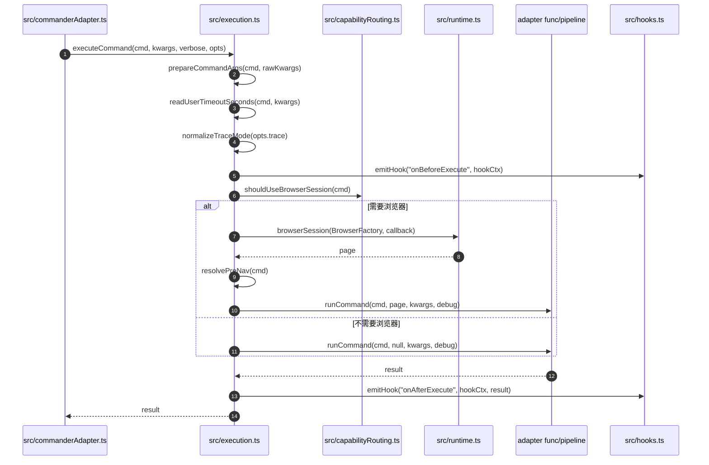

# Execution 1：`executeCommand()` 总入口

这个文件解释 `src/execution.ts` 的核心函数如何接管一个 adapter 命令。

## 时序图



## 关键方法解析

| 方法 | 文件 | 作用 | 关键点 |
|---|---|---|---|
| `executeCommand(cmd, rawKwargs, debug, opts)` | `src/execution.ts:196` | adapter 执行总入口。 | 参数校验、hook、trace、timeout、浏览器会话、预导航、调用 adapter 都在这里串起来。 |
| `prepareCommandArgs(cmd, rawKwargs)` | `src/execution.ts:473` | 统一准备参数。 | 先 `coerceAndValidateArgs()`，再执行 adapter 自己的 `validateArgs`。 |
| `coerceAndValidateArgs(cmdArgs, kwargs)` | `src/execution.ts:53` | 类型转换和 required/choices 校验。 | 把 Commander 传来的字符串转换成 adapter 期望的 number/boolean。 |
| `readUserTimeoutSeconds(cmd, kwargs)` | `src/execution.ts:542` | 读取 adapter 暴露的 `timeout` 参数。 | 只有 adapter 明确声明 `args` 中有 `timeout` 时，运行时才启用命令级 timeout。 |
| `normalizeTraceMode(raw)` | `src/execution.ts` | 标准化 trace 模式。 | 支持 `off`、`on`、`retain-on-failure`。 |
| `emitHook("onBeforeExecute")` | `src/hooks.ts` | 执行前 hook。 | plugin 可以在命令执行前观察或记录上下文，但 hook 失败不会阻断主流程。 |
| `shouldUseBrowserSession(cmd)` | `src/capabilityRouting.ts:46` | 判断是否需要浏览器。 | 这是 browser adapter 和普通 adapter 的分叉点。 |
| `runCommand(cmd, page, kwargs, debug)` | `src/execution.ts:97` | 真正执行 adapter。 | 支持 manifest 懒加载；然后选择 `func` 或 `pipeline`。 |
| `runCommandFunc(cmd, page, kwargs, debug)` | `src/execution.ts:152` | 调用 adapter 的 `func`。 | `browser:false` 调 `func(kwargs, debug)`；`browser:true` 调 `func(page, kwargs, debug)`。 |

## 关键代码摘录

下面是 `executeCommand()` 的骨架，保留了最关键的分支：

```ts
export async function executeCommand(cmd, rawKwargs, debug = false, opts = {}) {
  // 1. 参数准备：如果 Commander 已经 prepare 过，就直接使用 rawKwargs。
  const kwargs = opts.prepared
    ? rawKwargs
    : prepareCommandArgs(cmd, rawKwargs);

  // 2. 运行时配置：timeout 和 trace 都在进入 adapter 前确定。
  const userTimeoutSec = readUserTimeoutSeconds(cmd, kwargs);
  const traceMode = normalizeTraceMode(opts.trace);

  // 3. hook 上下文：plugin 可以观察命令开始/结束。
  const hookCtx = {
    command: fullName(cmd),
    args: kwargs,
    startedAt: Date.now(),
  };
  await emitHook('onBeforeExecute', hookCtx);

  let result;
  try {
    if (shouldUseBrowserSession(cmd)) {
      // 4A. browser adapter：准备 BrowserFactory，然后进入 browserSession。
      const BrowserFactory = getBrowserFactory(cmd.site);
      result = await browserSession(BrowserFactory, async (page) => {
        const preNavUrl = resolvePreNav(cmd);
        if (preNavUrl) await page.goto(preNavUrl);

        // page 会传进 browser func 或 browser pipeline。
        return runWithTimeout(runCommand(cmd, page, kwargs, debug), {
          timeout: DEFAULT_BROWSER_COMMAND_TIMEOUT,
          label: fullName(cmd),
        });
      });
    } else {
      // 4B. non-browser adapter：不创建 page，直接执行。
      result = await runCommand(cmd, null, kwargs, debug);
    }
  } catch (err) {
    // 5. 失败时也触发 onAfterExecute，方便 hook 记录错误。
    hookCtx.error = err;
    hookCtx.finishedAt = Date.now();
    await emitHook('onAfterExecute', hookCtx);
    throw err;
  }

  // 6. 成功时触发 onAfterExecute，并返回 adapter 结果。
  hookCtx.finishedAt = Date.now();
  await emitHook('onAfterExecute', hookCtx, result);
  return result;
}
```

`runCommand()` 是 adapter 执行的第二个关键点：

```ts
async function runCommand(cmd, page, kwargs, debug) {
  const internal = cmd;

  // manifest 快路径注册的是 lazy command。
  // 真正执行时才 import adapter 模块，让模块里的 cli({...}) 重新注册完整命令。
  if (internal._lazy && internal._modulePath) {
    await import(pathToFileURL(internal._modulePath).href);

    // import 后从 registry 取更新后的命令。
    const updated = getRegistry().get(fullName(cmd));
    if (updated?.func) {
      return runCommandFunc(updated, page, kwargs, debug);
    }
    if (updated?.pipeline) {
      return executePipeline(page, updated.pipeline, { args: kwargs, debug });
    }
  }

  // 非 lazy 或已经是完整命令：func 优先，其次 pipeline。
  if (cmd.func) return runCommandFunc(cmd, page, kwargs, debug);
  if (cmd.pipeline) return executePipeline(page, cmd.pipeline, { args: kwargs, debug });

  throw new CommandExecutionError(`Command ${fullName(cmd)} has no func or pipeline`);
}
```

`runCommandFunc()` 负责处理 browser 和 non-browser 的函数签名差异：

```ts
function runCommandFunc(cmd, page, kwargs, debug) {
  if (cmd.browser === false) {
    // PUBLIC / LOCAL adapter 常见签名：func(kwargs, debug)
    return cmd.func(kwargs, debug);
  }

  if (!page) {
    throw new CommandExecutionError(
      `Command ${fullName(cmd)} requires a browser session but none was provided`,
    );
  }

  // COOKIE / UI / INTERCEPT / browser:true 常见签名：func(page, kwargs, debug)
  return cmd.func(page, kwargs, debug);
}
```

## `executeCommand()` 的核心逻辑

`executeCommand()` 可以拆成 6 步：

1. 准备参数：把 CLI 参数变成 adapter 的 `kwargs`。
2. 读取运行配置：timeout、trace、profile、windowMode、siteSession。
3. 触发执行前 hook。
4. 判断是否需要浏览器。
5. 根据分支执行 adapter：browser 分支传 `page`，非 browser 分支传 `null`。
6. 触发执行后 hook，并返回结果。

## 读源码时最该盯住的变量

| 变量 | 含义 |
|---|---|
| `cmd` | registry 里的 adapter 命令定义。 |
| `kwargs` | 已校验、已合并默认值的 adapter 参数。 |
| `opts.profile` | 指定 Chrome profile/context。 |
| `opts.trace` | 是否采集 trace artifact。 |
| `siteSession` | adapter 会话生命周期，`ephemeral` 或 `persistent`。 |
| `session` | 传给 Browser Bridge 的 session 名。 |
| `keepTab` | 命令结束后是否保留 tab lease。 |
| `windowMode` | 自动化窗口前台或后台。 |
