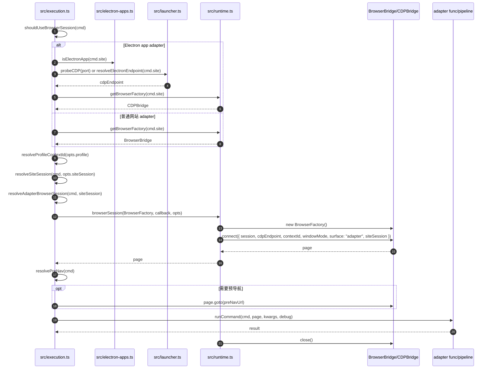

# Execution 2：浏览器会话与 Adapter 调度

这个文件解释 `execution.ts` 如何决定是否创建浏览器，以及创建后如何把 `page` 传给 adapter。

## 时序图



## 关键方法解析

| 方法 | 文件 | 作用 | 关键点 |
|---|---|---|---|
| `shouldUseBrowserSession(cmd)` | `src/capabilityRouting.ts:46` | 判断 adapter 是否需要浏览器。 | browser `func` 一定需要；pipeline 只有包含浏览器步骤或有 `navigateBefore` 时需要。 |
| `isElectronApp(cmd.site)` | `src/electron-apps.ts` | 判断是否是 Electron app adapter。 | Electron app 不走 bycli extension，而是直接连接 app 暴露的 CDP endpoint。 |
| `probeCDP(port)` | `src/launcher.ts` | 验证手动指定的 CDP endpoint 是否可用。 | 当设置 `BYCLI_CDP_ENDPOINT` 时会先探测端口。 |
| `resolveElectronEndpoint(cmd.site)` | `src/launcher.ts` | 自动发现 Electron app 的 CDP endpoint。 | 比如 Cursor、Codex、ChatGPT app 这类本地 app。 |
| `getBrowserFactory(site)` | `src/runtime.ts:11` | 选择 `BrowserBridge` 或 `CDPBridge`。 | 普通网站返回 `BrowserBridge`；Electron app 返回 `CDPBridge`。 |
| `browserSession(BrowserFactory, fn, opts)` | `src/runtime.ts:73` | 统一管理浏览器连接生命周期。 | `connect()` 产生 `page`，`finally` 中 `close()`。 |
| `resolveSiteSession(cmd, opts.siteSession)` | `src/execution.ts:496` | 决定 adapter 会话生命周期。 | 默认 `ephemeral`；可由命令定义或 CLI option 改成 `persistent`。 |
| `resolveAdapterBrowserSession(cmd, siteSession)` | `src/execution.ts:500` | 生成 Browser Bridge session 名。 | `persistent` 用 `site:<site>`；`ephemeral` 用 `site:<site>:<uuid>`。 |
| `resolveKeepTab(siteSession, opts.keepTab)` | `src/execution.ts:512` | 决定命令结束是否释放 tab lease。 | persistent 默认保留；ephemeral 默认释放。 |
| `resolveBrowserWindowMode(defaultMode, opts.windowMode)` | `src/execution.ts:523` | 决定自动化窗口前台/后台。 | adapter 默认 background，可用 `--window foreground` 或 `BYCLI_WINDOW` 改。 |
| `resolvePreNav(cmd)` | `src/execution.ts:160` | 获取预导航 URL。 | `Strategy.COOKIE + domain` 通常在 `registry.normalizeCommand()` 中推导出来。 |

## 关键代码摘录

`getBrowserFactory()` 是普通网站和 Electron app 的分叉点：

```ts
export function getBrowserFactory(site?: string): new () => IBrowserFactory {
  // Electron app 直接走 CDPBridge，连接 app 暴露的 DevTools endpoint。
  if (site && isElectronApp(site)) return CDPBridge;

  // 普通网站走 BrowserBridge，也就是 daemon + Chrome Extension。
  return BrowserBridge;
}
```

`browserSession()` 统一管理连接生命周期：

```ts
export async function browserSession(BrowserFactory, fn, opts = {}) {
  const browser = new BrowserFactory();
  try {
    // connect() 返回 IPage。
    // 对 BrowserBridge 来说，这个 page 是 src/browser/page.ts 的 Page。
    // 对 CDPBridge 来说，这个 page 是直接基于 CDP WebSocket 的 CDPPage。
    const page = await browser.connect({
      timeout: DEFAULT_BROWSER_CONNECT_TIMEOUT,
      session: opts.session,
      cdpEndpoint: opts.cdpEndpoint,
      contextId: opts.contextId,
      windowMode: opts.windowMode,
      surface: opts.surface,
      siteSession: opts.siteSession,
    });

    return await fn(page);
  } finally {
    // BrowserBridge.close() 不杀 daemon，只释放本次 factory 引用。
    // CDPBridge.close() 会关闭 WebSocket。
    await browser.close().catch(() => {});
  }
}
```

`execution.ts` 在进入 `browserSession()` 前会把 session 策略算好：

```ts
function resolveAdapterBrowserSession(cmd, siteSession) {
  if (siteSession === 'persistent') {
    // 同一个站点复用稳定 session，extension 侧 tab lease 不会自动过期。
    return `site:${cmd.site}`;
  }

  // 默认 ephemeral：每次 adapter 命令用独立 UUID，避免串状态。
  return `site:${cmd.site}:${crypto.randomUUID()}`;
}

function resolveKeepTab(siteSession, rawOption) {
  // persistent session 默认保留 tab lease。
  if (siteSession === 'persistent') return true;

  // ephemeral 默认不保留，除非用户显式 --keep-tab true。
  return normalizeBooleanOption('--keep-tab', rawOption) ?? false;
}
```

预导航只返回字符串 URL，真正导航由 `page.goto()` 执行：

```ts
function resolvePreNav(cmd) {
  if (cmd.navigateBefore === false) return null;
  if (typeof cmd.navigateBefore === 'string') return cmd.navigateBefore;

  // strategy 到 navigateBefore 的推导已经在 registry.normalizeCommand() 做完。
  return null;
}
```

## 普通网站和 Electron app 的区别

| 类型 | 链路 | 说明 |
|---|---|---|
| 普通网站 adapter | `BrowserBridge -> daemon -> Chrome Extension -> chrome.debugger` | 复用用户 Chrome 登录态，靠扩展操作页面。 |
| Electron app adapter | `CDPBridge -> CDP WebSocket` | 直接连本地 app 暴露的 DevTools endpoint，不依赖 Chrome 扩展。 |

## session / siteSession / keepTab 的关系

`execution.ts` 不直接操作 Chrome tab，它只生成抽象的 session 信息：

```text
siteSession = ephemeral
  -> session = site:<site>:<uuid>
  -> keepTab 默认 false
  -> 命令结束 page.closeWindow()

siteSession = persistent
  -> session = site:<site>
  -> keepTab 默认 true
  -> tab lease 不因单次命令结束而释放
```

真正的 tab lease 创建、复用、释放发生在 extension 的 `background.ts`。
