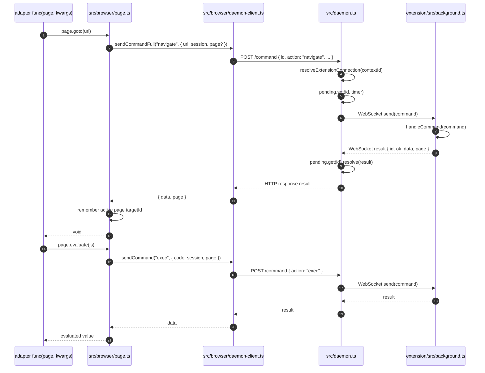

# Execution 3：CLI 到 daemon 的通信链路

这个文件解释普通网站 browser adapter 如何从 `page.goto()` / `page.evaluate()` 走到 bycli daemon，再由 daemon 转发给 Chrome Extension。

## 总体时序图



## 关键方法解析

| 方法 | 文件 | 作用 | 关键点 |
|---|---|---|---|
| `Page.goto(url)` | `src/browser/page.ts:87` | 发送 `navigate` 命令给 daemon。 | 用 `sendCommandFull()`，因为返回里包含 `page` targetId，需要记住给后续命令用。 |
| `Page.evaluate(input, ...args)` | `src/browser/page.ts:169` | 发送 `exec` 命令给 daemon。 | 把函数或字符串变成可执行 JS，再交给 extension 在页面上下文执行。 |
| `Page.cdp(method, params)` | `src/browser/page.ts:336` | 发送 `cdp` passthrough 命令。 | 用于少量允许的原生 CDP 能力，比如 DOM、Input、Page、Accessibility。 |
| `sendCommand(action, params)` | `src/browser/daemon-client.ts:234` | 发送命令并只返回 `data`。 | 大多数 page 方法使用它。 |
| `sendCommandFull(action, params)` | `src/browser/daemon-client.ts:246` | 发送命令并返回 `data + page`。 | 页面级命令用它维持 targetId。 |
| `sendCommandRaw(action, params)` | `src/browser/daemon-client.ts:175` | HTTP POST `/command` 的底层实现。 | 生成 command id，带 `X-byCLI` header，最多重试 4 次。 |
| `requestDaemon(pathname, init)` | `src/browser/daemon-client.ts:111` | daemon HTTP 请求封装。 | 默认访问 `http://127.0.0.1:19825`，带超时和 `X-byCLI` header。 |
| `handleRequest(req, res)` | `src/daemon.ts:191` | daemon HTTP 入口。 | 做 Origin / header 安全检查，处理 `/status`、`/logs`、`/shutdown`、`/command`。 |
| `POST /command` handler | `src/daemon.ts:292` | 接收 CLI 命令并转发给 extension。 | 找到对应 profile 的 extension WebSocket，写入 pending，等待 result。 |
| `resolveExtensionConnection(contextId)` | `src/daemon.ts:85` | 选择哪个 Chrome profile 的 extension。 | 无 profile、多 profile、指定 profile 断开都会产生不同错误。 |
| `wss.on("connection")` | `src/daemon.ts:390` | 接收 extension WebSocket 连接。 | extension 先发 `hello`，daemon 记录 profile/contextId。 |
| `ws.on("message")` | `src/daemon.ts:414` | 接收 extension 返回。 | 如果是 result，就按 `id` 找 pending promise 并 resolve。 |

## 关键代码摘录

`Page.goto()` 展示了 `Page -> daemon` 的基本模式：

```ts
async goto(url, options) {
  // navigate 是页面级命令，需要拿回 page targetId。
  const result = await sendCommandFull('navigate', {
    url,
    ...this._cmdOpts(), // session、surface、page、contextId 等都在这里带上
  });

  // daemon/extension 返回 page 后，Page 对象记住它。
  // 后续 evaluate/screenshot/cdp 都会带这个 page，确保落在同一个 tab。
  if (result.page) {
    this._page = result.page;
  }

  this._lastUrl = url;

  // 导航后注入 stealth，并等待 DOM 稳定。
  if (options?.waitUntil !== 'none') {
    const combinedCode = `${generateStealthJs()};\n${waitForDomStableJs(...)}`;
    await sendCommand('exec', {
      code: combinedCode,
      ...this._cmdOpts(),
    });
  }
}
```

`Page.evaluate()` 则是把 JS 代码发给 daemon 的 `exec` action：

```ts
async evaluate(input, ...args) {
  // 支持传字符串，也支持传函数 + 参数。
  const code = buildEvaluateExpression(input, args);

  // exec 最终会在 extension 中变成 CDP Runtime.evaluate。
  return await sendCommand('exec', {
    code,
    ...this._cmdOpts(),
  });
}
```

`sendCommandRaw()` 是 CLI 侧发 daemon 命令的底层：

```ts
async function sendCommandRaw(action, params) {
  for (let attempt = 1; attempt <= 4; attempt++) {
    const id = generateId();
    const command = {
      id,
      action,
      ...params,
      contextId: params.contextId ?? resolveProfileContextId(),
    };

    const res = await requestDaemon('/command', {
      method: 'POST',
      headers: { 'Content-Type': 'application/json' },
      body: JSON.stringify(command),
      timeout: 30000,
    });

    const result = await res.json();
    if (result.ok) return result;

    // 对网络抖动、重复 id、瞬时浏览器错误做有限重试。
    // 不可恢复错误会抛 BrowserCommandError。
  }
}
```

daemon 的 `/command` handler 是 HTTP 到 WebSocket 的桥：

```ts
if (req.method === 'POST' && url === '/command') {
  const body = JSON.parse(await readBody(req));

  // 根据 contextId 找到对应 Chrome profile 的 extension WebSocket。
  const route = resolveExtensionConnection(body.contextId);
  if (!route.connection) {
    jsonResponse(res, 503, { ok: false, errorCode: route.errorCode });
    return;
  }

  const result = await new Promise((resolve, reject) => {
    const timer = setTimeout(() => {
      pending.delete(body.id);
      reject(new Error('Command timeout'));
    }, timeoutMs);

    // pending 用 command id 把 HTTP 请求和 WS 返回配对。
    pending.set(body.id, { resolve, reject, timer, ... });

    // 发给 extension service worker。
    route.connection.ws.send(JSON.stringify(body));
  });

  // extension 返回后，daemon 才完成这次 HTTP response。
  jsonResponse(res, 200, result);
}
```

extension 的 result 回来后，daemon 通过 `id` 找 pending：

```ts
ws.on('message', (data) => {
  const msg = JSON.parse(data.toString());

  // hello/log 是控制消息；其它带 id 的通常是 command result。
  const p = pending.get(msg.id);
  if (p) {
    clearTimeout(p.timer);
    pending.delete(msg.id);
    p.resolve(msg);
  }
});
```

## daemon 的角色

daemon 是 CLI 和 Chrome Extension 之间的本地桥：

```text
CLI process
  -- HTTP POST /command -->
bycli daemon
  -- WebSocket -->
Chrome Extension service worker
  -- chrome.tabs / chrome.debugger -->
Chrome tab
```

它不是直接操作 Chrome DevTools 的那一层。真正调用 `chrome.debugger.sendCommand()` 的是 extension 里的 `extension/src/cdp.ts`。

## 为什么需要 `page` targetId

`Page.goto()` 返回后会保存：

```ts
this._page = result.page;
```

这个 `page` 是跨层的页面身份，也就是 targetId。后续 `evaluate()`、`screenshot()`、`cdp()` 都会带上它：

```text
{ session, surface, page, contextId, ... }
```

这样 extension 不用猜“当前 tab 是哪个”，而是能把命令准确路由到同一个页面。

## daemon 的安全边界

daemon 监听本地回环地址：

```text
127.0.0.1:19825
```

但它仍然做了几层防护：

- 非 `chrome-extension://` 的浏览器 Origin 被拒绝。
- 除 `/ping` 外，HTTP 请求必须带 `X-byCLI`。
- 不给普通命令端点返回 CORS 允许头。
- 请求体有 1 MB 限制。
- WebSocket upgrade 也检查 Origin。
