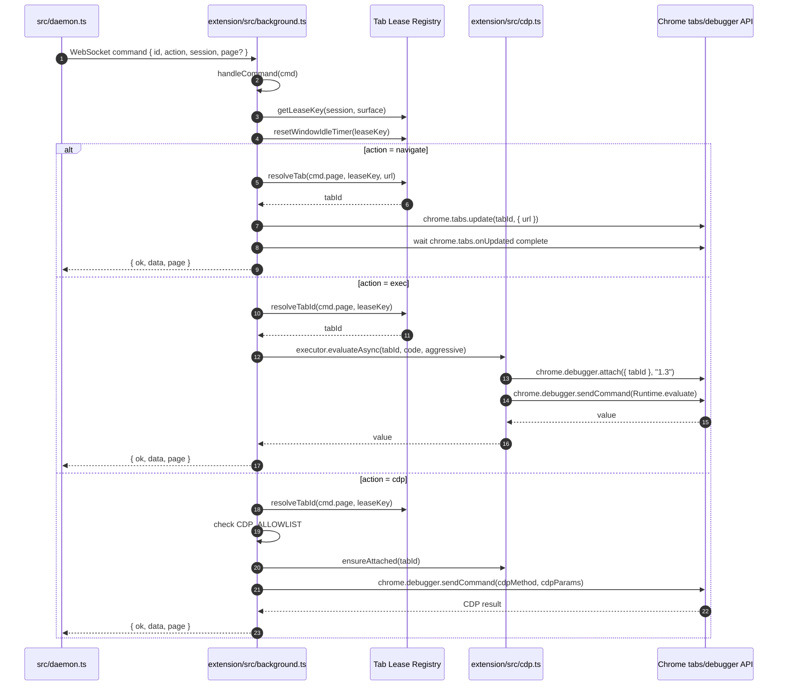

# Execution 4：Extension 如何操作 Chrome DevTools

这个文件解释 Chrome Extension 收到 daemon 命令后，如何用 Chrome API 和 Chrome DevTools Protocol 操作真实页面。

## 时序图：extension 分发命令



## 关键方法解析

| 方法 | 文件 | 作用 | 关键点 |
|---|---|---|---|
| `connect()` | `extension/src/background.ts:107` | extension 主动连接 daemon。 | 先 fetch `/ping`，避免 daemon 不在时直接 new WebSocket 造成 Chrome 扩展错误噪声。 |
| `thisWs.onopen` | `extension/src/background.ts:139` | 连接建立后发送 hello。 | 带上 `contextId`、extension version、compat range，daemon 用它识别 profile。 |
| `thisWs.onmessage` | `extension/src/background.ts:156` | 收 daemon 命令。 | JSON parse 后调用 `handleCommand(command)`，再把 result 发回 daemon。 |
| `handleCommand(cmd)` | `extension/src/background.ts:966` | extension 命令分发总入口。 | 根据 `cmd.action` 分派到 `handleExec`、`handleNavigate`、`handleCdp` 等 handler。 |
| `getLeaseKey(session, surface)` | `extension/src/background.ts:276` | 生成 tab lease key。 | 同一个 session + surface 对应同一组 tab/window 资源。 |
| `resolveTab(...)` | `extension/src/background.ts:1132` | 找到或创建目标 tab。 | 优先使用传入 page；再复用已有 lease；必要时创建 byCLI automation tab。 |
| `handleNavigate(cmd, leaseKey)` | `extension/src/background.ts:1310` | 执行页面导航。 | 调 `chrome.tabs.update()`，等待 `tabs.onUpdated` 到 complete，并返回 page targetId。 |
| `handleExec(cmd, leaseKey)` | `extension/src/background.ts:1277` | 执行页面 JS。 | 解析 tab 后调用 `executor.evaluateAsync()`，本质是 CDP `Runtime.evaluate`。 |
| `handleCdp(cmd, leaseKey)` | `extension/src/background.ts:1577` | 透传白名单 CDP 命令。 | 只有 `CDP_ALLOWLIST` 里的方法能被调用，避免暴露任意 DevTools 权限。 |
| `ensureAttached(tabId, aggressiveRetry)` | `extension/src/cdp.ts:67` | 用 `chrome.debugger.attach()` 连接目标 tab。 | 会校验 URL 是否可 debug，并处理其它扩展干扰导致的 attach 失败。 |
| `evaluate(tabId, expression, aggressiveRetry)` | `extension/src/cdp.ts:158` | 执行 CDP `Runtime.evaluate`。 | 先 attach，再 `chrome.debugger.sendCommand({ tabId }, "Runtime.evaluate", ...)`。 |
| `screenshot(tabId, options)` | `extension/src/cdp.ts:208` | 截图。 | 通过 `Page.captureScreenshot`，fullPage 时会先读取布局指标并设置 emulation。 |
| `setFileInputFiles(...)` | `extension/src/cdp.ts:279` | 设置文件 input。 | 通过 `DOM.setFileInputFiles`，Chrome 直接读取本地文件。 |
| `startNetworkCapture(...)` | `extension/src/cdp.ts` | 开启网络捕获。 | 通过 CDP Network domain 监听请求/响应并读取 response body。 |

## 关键代码摘录

extension 启动后会主动连接 daemon：

```ts
async function connectAttempt() {
  // 先探测 /ping，避免 daemon 不在时直接 new WebSocket 产生扩展控制台噪声。
  const res = await fetch(DAEMON_PING_URL, { signal: AbortSignal.timeout(1000) });
  if (!res.ok) return;

  const contextId = await getCurrentContextId();
  const thisWs = new WebSocket(DAEMON_WS_URL);
  ws = thisWs;

  thisWs.onopen = () => {
    // hello 告诉 daemon：哪个 Chrome profile 连上来了，以及扩展版本。
    safeSend(thisWs, {
      type: 'hello',
      contextId,
      version: chrome.runtime.getManifest().version,
      compatRange: __BYCLI_COMPAT_RANGE__,
    });
  };

  thisWs.onmessage = async (event) => {
    // daemon 发来的 command 在这里进入 extension。
    const command = JSON.parse(event.data);
    const result = await handleCommand(command);
    safeSend(thisWs, result);
  };
}
```

`handleCommand()` 是 extension 的分发器：

```ts
async function handleCommand(cmd) {
  const session = getSessionName(cmd.session);
  const surface = getCommandSurface(cmd);
  const leaseKey = getLeaseKey(session, surface);

  // 每个命令都会刷新 idle timer，说明这个 session 还活着。
  resetWindowIdleTimer(leaseKey);

  switch (cmd.action) {
    case 'exec':
      return await handleExec(cmd, leaseKey);
    case 'navigate':
      return await handleNavigate(cmd, leaseKey);
    case 'cdp':
      return await handleCdp(cmd, leaseKey);
    case 'screenshot':
      return await handleScreenshot(cmd, leaseKey);
    // tabs / cookies / bind / network-capture 等也在这里分派。
    default:
      return { id: cmd.id, ok: false, error: `Unknown action: ${cmd.action}` };
  }
}
```

各个 `handleXXX()` 的关键代码和对应 `cmd` 数据结构放在后面的“各 `handleXXX()` 分支”里，按 `switch` 分支逐个展开。

`ensureAttached()` 是进入 Chrome DevTools Protocol 的门：

```ts
export async function ensureAttached(tabId, aggressiveRetry = false) {
  const tab = await chrome.tabs.get(tabId);
  if (!isDebuggableUrl(tab.url)) {
    throw new Error(`Cannot debug tab ${tabId}: URL is ${tab.url}`);
  }

  // 如果缓存说已 attach，先发一个 Runtime.evaluate 验证连接还活着。
  if (attached.has(tabId)) {
    try {
      await chrome.debugger.sendCommand({ tabId }, 'Runtime.evaluate', {
        expression: '1',
        returnByValue: true,
      });
      return;
    } catch {
      attached.delete(tabId);
    }
  }

  // attach 可能被其它扩展干扰，所以这里有重试。
  await chrome.debugger.attach({ tabId }, '1.3');
  attached.add(tabId);

  // Runtime.enable 后才稳定执行 Runtime.evaluate。
  await chrome.debugger.sendCommand({ tabId }, 'Runtime.enable').catch(() => {});
}
```

`evaluate()` 是最终执行页面 JS 的地方：

```ts
export async function evaluate(tabId, expression, aggressiveRetry = false) {
  await ensureAttached(tabId, aggressiveRetry);

  const result = await chrome.debugger.sendCommand(
    { tabId },
    'Runtime.evaluate',
    {
      expression,
      returnByValue: true,
      awaitPromise: true,
    },
  );

  if (result.exceptionDetails) {
    throw new Error(result.exceptionDetails.exception?.description || 'Eval error');
  }

  return result.result?.value;
}
```

## 各 `handleXXX()` 收到的 `cmd` 结构

daemon 通过 WebSocket 发给 extension 的 command 都符合 `extension/src/protocol.ts` 的 `Command` 结构。每个 handler 都会先共享这些基础字段：

下面每个 `handleXXX()` 小节都把“可能收到的 `cmd` 数据结构”和“关键代码摘录”放在一起。代码摘录是为了理解主路径而做的精简版：保留字段读取、关键分支、核心调用和返回形态；完整实现请对照 `extension/src/background.ts` 与 `extension/src/cdp.ts`。

```ts
type CommandBase = {
  id: string;                       // daemon-client 生成的请求 ID，用于匹配返回结果
  action: string;                   // handleCommand() switch 的分支依据
  session?: string;                 // BrowserBridge session，例如 site:brave:<uuid>
  surface?: 'browser' | 'adapter';  // adapter 命令通常是 adapter；bycli browser 是 browser
  page?: string;                    // 页面 targetId；navigate 后保存，后续命令带上
  contextId?: string;               // Chrome profile/context，daemon 用它路由到正确 extension
  windowMode?: 'foreground' | 'background';
  idleTimeout?: number;
  siteSession?: 'ephemeral' | 'persistent';
};
```

返回值统一是：

```ts
type Result = {
  id: string;          // 对应 command.id
  ok: boolean;
  data?: unknown;      // 成功结果
  error?: string;      // 失败消息
  errorCode?: string;  // 机器可读错误码
  errorHint?: string;  // 给 CLI/agent 的修复提示
  page?: string;       // 页面级命令会返回 targetId
};
```

### `handleExec(cmd, leaseKey)`

来源：`Page.evaluate()` 或 `Page.evaluateInFrame()`。

关键代码：

```ts
async function handleExec(cmd, leaseKey) {
  if (!cmd.code) return { id: cmd.id, ok: false, error: 'Missing code' };

  // page targetId -> tabId；没有 page 时通过 session lease 找 tab。
  const cmdTabId = await resolveCommandTabId(cmd);
  const tabId = await resolveTabId(cmdTabId, leaseKey);

  const aggressive = getSurfaceFromKey(leaseKey) === 'browser';

  if (cmd.frameIndex != null) {
    // 跨域 iframe 执行：先拿 frame tree，再按 frameIndex 找 frameId。
    const tree = await executor.getFrameTree(tabId);
    const frames = enumerateCrossOriginFrames(tree);
    const data = await executor.evaluateInFrame(tabId, cmd.code, frames[cmd.frameIndex].frameId, aggressive);
    return pageScopedResult(cmd.id, tabId, data);
  }

  // 普通页面执行：CDP Runtime.evaluate。
  const data = await executor.evaluateAsync(tabId, cmd.code, aggressive);
  return pageScopedResult(cmd.id, tabId, data);
}
```

`cmd` 结构：

```ts
type ExecCommand = CommandBase & {
  action: 'exec';
  code: string;        // 要在页面上下文执行的 JS
  frameIndex?: number; // 可选：跨域 iframe 索引，来自 Page.evaluateInFrame()
};
```

典型输入：

```json
{
  "id": "cmd_123_1710000000000_2",
  "action": "exec",
  "session": "site:brave:550e8400-e29b-41d4-a716-446655440000",
  "surface": "adapter",
  "contextId": "default",
  "page": "A1B2C3D4...",
  "code": "(() => document.title)()"
}
```

典型返回：

```json
{
  "id": "cmd_123_1710000000000_2",
  "ok": true,
  "data": "bycli - Brave Search",
  "page": "A1B2C3D4..."
}
```

关键点：`page` 存在时，`resolveCommandTabId(cmd)` 会把 targetId 解析回 tabId；没有 `page` 时才回落到 session lease。

### `handleNavigate(cmd, leaseKey)`

来源：`Page.goto(url)`。

关键代码：

```ts
async function handleNavigate(cmd, leaseKey) {
  if (!cmd.url) return { id: cmd.id, ok: false, error: 'Missing url' };
  if (!isSafeNavigationUrl(cmd.url)) {
    return { id: cmd.id, ok: false, error: 'Blocked URL scheme' };
  }

  // initialUrl 传给 resolveTab：首次创建 automation tab 时可以直接打开目标 URL。
  const cmdTabId = await resolveCommandTabId(cmd);
  const resolved = await resolveTab(cmdTabId, leaseKey, cmd.url);
  const tabId = resolved.tabId;

  // 导航前 detach，避免旧 debugger attach 状态污染导航后的 Runtime.evaluate。
  if (!executor.hasActiveNetworkCapture(tabId)) {
    await executor.detach(tabId);
  }

  await chrome.tabs.update(tabId, { url: cmd.url });
  await waitUntilTabCompleteOrTimeout(tabId);

  const tab = await chrome.tabs.get(tabId);
  return pageScopedResult(cmd.id, tabId, {
    title: tab.title,
    url: tab.url,
    timedOut,
  });
}
```

`cmd` 结构：

```ts
type NavigateCommand = CommandBase & {
  action: 'navigate';
  url: string; // 只允许 http:// 或 https://
};
```

典型输入：

```json
{
  "id": "cmd_123_1710000000000_1",
  "action": "navigate",
  "session": "site:brave:550e8400-e29b-41d4-a716-446655440000",
  "surface": "adapter",
  "contextId": "default",
  "url": "https://search.brave.com/search?q=bycli",
  "windowMode": "background",
  "siteSession": "ephemeral"
}
```

典型返回：

```json
{
  "id": "cmd_123_1710000000000_1",
  "ok": true,
  "data": {
    "title": "bycli - Brave Search",
    "url": "https://search.brave.com/search?q=bycli",
    "timedOut": false
  },
  "page": "A1B2C3D4..."
}
```

关键点：`navigate` 通常是第一个产生 `page` targetId 的命令；后续 `exec`、`cdp`、`screenshot` 都靠它保持同一个 tab。

### `handleTabs(cmd, leaseKey)`

来源：`Page.tabs()`、`Page.newTab()`、`Page.selectTab()`、`Page.closeTab()`。

关键代码：

```ts
async function handleTabs(cmd, leaseKey) {
  const session = automationSessions.get(leaseKey);

  // bound tab 是用户自己的 tab，禁止 new/select/close 这类 mutation。
  if (session && !session.owned && cmd.op !== 'list') {
    return { id: cmd.id, ok: false, errorCode: 'bound_tab_mutation_blocked' };
  }

  switch (cmd.op) {
    case 'list':
      return { id: cmd.id, ok: true, data: await listTabsWithTargetIds(leaseKey) };

    case 'new':
      const created = await createOrOpenTabInOwnedWindow(leaseKey, cmd.url);
      return pageScopedResult(cmd.id, created.tabId, { url: created.tab?.url });

    case 'select':
      const selectedTabId = cmd.page
        ? await identity.resolveTabId(cmd.page)
        : tabIdAtIndex(leaseKey, cmd.index);
      await chrome.tabs.update(selectedTabId, { active: true });
      return pageScopedResult(cmd.id, selectedTabId, { selected: true });

    case 'close':
      const closedTabId = await resolveTabId(await resolveCommandTabId(cmd), leaseKey);
      await releaseOrRemoveTab(leaseKey, closedTabId);
      return { id: cmd.id, ok: true, data: { closed: cmd.page } };
  }
}
```

`cmd` 结构：

```ts
type TabsCommand = CommandBase & {
  action: 'tabs';
  op: 'list' | 'new' | 'close' | 'select';
  index?: number; // select/close 可用 tab index
  page?: string;  // select/close 也可用 targetId
  url?: string;   // new 可带初始 URL
};
```

典型输入：

```json
{
  "id": "cmd_123_1710000000000_4",
  "action": "tabs",
  "session": "debug-session",
  "surface": "browser",
  "contextId": "default",
  "op": "new",
  "url": "https://example.com"
}
```

常见 `op`：

```text
list   -> 列出 session 里的 debuggable tabs
new    -> 在 owned byCLI window 里新建 tab
select -> 选择 index 或 page 对应的 tab
close  -> 关闭 index、page 或当前 tab
```

关键点：如果 session 是 bound user tab，除 `list` 外的 tab mutation 会被拒绝，避免误关/误改用户自己的标签页。

### `handleCookies(cmd)`

来源：`Page.getCookies()`。

关键代码：

```ts
async function handleCookies(cmd) {
  if (!cmd.domain && !cmd.url) {
    return {
      id: cmd.id,
      ok: false,
      error: 'Cookie scope required: provide domain or url to avoid dumping all cookies',
    };
  }

  const details = {};
  if (cmd.domain) details.domain = cmd.domain;
  if (cmd.url) details.url = cmd.url;

  const cookies = await chrome.cookies.getAll(details);
  return { id: cmd.id, ok: true, data: cookies.map(toSafeCookieRow) };
}
```

`cmd` 结构：

```ts
type CookiesCommand = CommandBase & {
  action: 'cookies';
  domain?: string;
  url?: string;
};
```

典型输入：

```json
{
  "id": "cmd_123_1710000000000_5",
  "action": "cookies",
  "session": "site:xueqiu:...",
  "surface": "adapter",
  "contextId": "default",
  "domain": "xueqiu.com"
}
```

关键点：`domain` 和 `url` 至少要有一个，否则 handler 会拒绝请求，避免 dump 全部 cookie。

### `handleScreenshot(cmd, leaseKey)`

来源：`Page.screenshot()`。

关键代码：

```ts
async function handleScreenshot(cmd, leaseKey) {
  const cmdTabId = await resolveCommandTabId(cmd);
  const tabId = await resolveTabId(cmdTabId, leaseKey);

  const data = await executor.screenshot(tabId, {
    format: cmd.format,
    quality: cmd.quality,
    fullPage: cmd.fullPage,
    width: cmd.width,
    height: cmd.height,
  });

  return pageScopedResult(cmd.id, tabId, data);
}
```

`cmd` 结构：

```ts
type ScreenshotCommand = CommandBase & {
  action: 'screenshot';
  format?: 'png' | 'jpeg';
  quality?: number;
  fullPage?: boolean;
  width?: number;
  height?: number;
};
```

典型输入：

```json
{
  "id": "cmd_123_1710000000000_6",
  "action": "screenshot",
  "session": "site:brave:...",
  "surface": "adapter",
  "page": "A1B2C3D4...",
  "format": "png",
  "fullPage": true,
  "width": 1280
}
```

典型返回：`data` 是 base64 图片字符串，页面级返回会带 `page`。

### `handleCdp(cmd, leaseKey)`

来源：`Page.cdp()`，以及 `Page` 内部的原生点击、键盘、dialog、DOM 定位等封装。

关键代码：

```ts
async function handleCdp(cmd, leaseKey) {
  if (!cmd.cdpMethod) return { id: cmd.id, ok: false, error: 'Missing cdpMethod' };
  if (!CDP_ALLOWLIST.has(cmd.cdpMethod)) {
    return { id: cmd.id, ok: false, error: `CDP method not permitted: ${cmd.cdpMethod}` };
  }

  const cmdTabId = await resolveCommandTabId(cmd);
  const tabId = await resolveTabId(cmdTabId, leaseKey);

  const aggressive = getSurfaceFromKey(leaseKey) === 'browser';
  await executor.ensureAttached(tabId, aggressive);

  const data = await chrome.debugger.sendCommand(
    { tabId },
    cmd.cdpMethod,
    cmd.cdpParams ?? {},
  );

  return pageScopedResult(cmd.id, tabId, data);
}
```

`cmd` 结构：

```ts
type CdpCommand = CommandBase & {
  action: 'cdp';
  cdpMethod: string;                 // 必须在 CDP_ALLOWLIST 中
  cdpParams?: Record<string, unknown>;
};
```

典型输入：

```json
{
  "id": "cmd_123_1710000000000_3",
  "action": "cdp",
  "session": "site:brave:550e8400-e29b-41d4-a716-446655440000",
  "surface": "adapter",
  "contextId": "default",
  "page": "A1B2C3D4...",
  "cdpMethod": "Input.dispatchMouseEvent",
  "cdpParams": {
    "type": "mousePressed",
    "x": 120,
    "y": 240,
    "button": "left",
    "clickCount": 1
  }
}
```

关键点：不是任意 CDP 命令都允许。`handleCdp()` 会先检查 `CDP_ALLOWLIST`，再调用 `chrome.debugger.sendCommand()`。

### `handleCloseWindow(cmd, leaseKey)`

来源：`Page.closeWindow()`，通常由 `execution.ts` 在 adapter 结束后调用。

关键代码：

```ts
async function handleCloseWindow(cmd, leaseKey) {
  const sessionName = automationSessions.get(leaseKey)?.session ?? getSessionFromKey(leaseKey);

  // 释放当前 session/surface 对应的 tab lease。
  await releaseLease(leaseKey, 'explicit close');

  return { id: cmd.id, ok: true, data: { closed: true, session: sessionName } };
}
```

`cmd` 结构：

```ts
type CloseWindowCommand = CommandBase & {
  action: 'close-window';
};
```

关键点：它释放的是当前 `session + surface` 对应的 tab lease。`BrowserBridge.close()` 不会杀 daemon；真正释放 tab lease 靠这个 action。

### `handleSetFileInput(cmd, leaseKey)`

来源：`Page.setFileInput()`。

关键代码：

```ts
async function handleSetFileInput(cmd, leaseKey) {
  if (!Array.isArray(cmd.files) || cmd.files.length === 0) {
    return { id: cmd.id, ok: false, error: 'Missing files' };
  }

  const cmdTabId = await resolveCommandTabId(cmd);
  const tabId = await resolveTabId(cmdTabId, leaseKey);

  await executor.setFileInputFiles(tabId, cmd.files, cmd.selector);
  return pageScopedResult(cmd.id, tabId, { count: cmd.files.length });
}
```

`cmd` 结构：

```ts
type SetFileInputCommand = CommandBase & {
  action: 'set-file-input';
  files: string[];  // 本地绝对路径数组
  selector?: string;
};
```

典型输入：

```json
{
  "id": "cmd_123_1710000000000_7",
  "action": "set-file-input",
  "session": "upload-flow",
  "surface": "browser",
  "page": "A1B2C3D4...",
  "files": ["/Users/lijiahui/Desktop/report.pdf"],
  "selector": "input[type=file]"
}
```

关键点：底层走 `DOM.setFileInputFiles`，Chrome 直接读取本地文件路径，不需要把文件内容塞进 WebSocket。

### `handleInsertText(cmd, leaseKey)`

来源：`Page.insertText()`，以及一些 native type fallback。

关键代码：

```ts
async function handleInsertText(cmd, leaseKey) {
  if (typeof cmd.text !== 'string') {
    return { id: cmd.id, ok: false, error: 'Missing text' };
  }

  const cmdTabId = await resolveCommandTabId(cmd);
  const tabId = await resolveTabId(cmdTabId, leaseKey);

  await executor.insertText(tabId, cmd.text);
  return pageScopedResult(cmd.id, tabId, { inserted: true });
}
```

`cmd` 结构：

```ts
type InsertTextCommand = CommandBase & {
  action: 'insert-text';
  text: string;
};
```

典型输入：

```json
{
  "id": "cmd_123_1710000000000_8",
  "action": "insert-text",
  "session": "editor-flow",
  "surface": "browser",
  "page": "A1B2C3D4...",
  "text": "你好，byCLI"
}
```

关键点：底层是 CDP `Input.insertText`，比模拟键盘事件更适合中文等 Unicode 文本。

### `handleBind(cmd, leaseKey)`

来源：`bycli browser <session> bind`。

关键代码：

```ts
async function handleBind(cmd, leaseKey) {
  const existing = automationSessions.get(leaseKey);
  if (existing) await releaseLease(leaseKey, 'rebind');

  // 找到用户当前 active tab，把它作为 borrowed lease 绑定到 session。
  const [boundTab] = await chrome.tabs.query({ active: true, currentWindow: true });
  if (!boundTab?.id || !isDebuggableUrl(boundTab.url)) {
    return { id: cmd.id, ok: false, error: 'No debuggable active tab to bind' };
  }

  setLeaseSession(leaseKey, {
    session: getSessionFromKey(leaseKey),
    surface: getSurfaceFromKey(leaseKey),
    kind: 'bound',
    windowId: boundTab.windowId,
    owned: false,
    preferredTabId: boundTab.id,
  });

  return pageScopedResult(cmd.id, boundTab.id, { bound: true, url: boundTab.url });
}
```

`cmd` 结构：

```ts
type BindCommand = CommandBase & {
  action: 'bind';
};
```

关键点：它把当前用户正在看的 Chrome tab 借给指定 session。这个 lease 是 borrowed，不允许随意 `tab new/select/close` 这类 mutation。

### `handleNetworkCaptureStart(cmd, leaseKey)`

来源：`Page.startNetworkCapture()`。

关键代码：

```ts
async function handleNetworkCaptureStart(cmd, leaseKey) {
  const cmdTabId = await resolveCommandTabId(cmd);
  const tabId = await resolveTabId(cmdTabId, leaseKey);

  await executor.startNetworkCapture(tabId, cmd.pattern);
  return pageScopedResult(cmd.id, tabId, { started: true });
}
```

`cmd` 结构：

```ts
type NetworkCaptureStartCommand = CommandBase & {
  action: 'network-capture-start';
  pattern?: string; // URL 子串过滤
};
```

典型输入：

```json
{
  "id": "cmd_123_1710000000000_9",
  "action": "network-capture-start",
  "session": "site:brave:...",
  "surface": "adapter",
  "page": "A1B2C3D4...",
  "pattern": "api"
}
```

关键点：底层启用 CDP Network domain，并在 extension 内缓存请求/响应摘要。

### `handleNetworkCaptureRead(cmd, leaseKey)`

来源：`Page.readNetworkCapture()`。

关键代码：

```ts
async function handleNetworkCaptureRead(cmd, leaseKey) {
  const cmdTabId = await resolveCommandTabId(cmd);
  const tabId = await resolveTabId(cmdTabId, leaseKey);

  const data = await executor.readNetworkCapture(tabId);
  return pageScopedResult(cmd.id, tabId, data);
}
```

`cmd` 结构：

```ts
type NetworkCaptureReadCommand = CommandBase & {
  action: 'network-capture-read';
};
```

典型输入：

```json
{
  "id": "cmd_123_1710000000000_10",
  "action": "network-capture-read",
  "session": "site:brave:...",
  "surface": "adapter",
  "page": "A1B2C3D4..."
}
```

典型返回：`data` 是 network entry 数组，包含 URL、method、headers、body preview、truncation 信息等。

### `handleWaitDownload(cmd)`

来源：`Page.waitForDownload()`。

关键代码：

```ts
async function handleWaitDownload(cmd) {
  const data = await executor.waitForDownload(
    cmd.pattern ?? '',
    cmd.timeoutMs ?? 30000,
  );

  return { id: cmd.id, ok: true, data };
}
```

`cmd` 结构：

```ts
type WaitDownloadCommand = CommandBase & {
  action: 'wait-download';
  pattern?: string;
  timeoutMs?: number;
};
```

典型输入：

```json
{
  "id": "cmd_123_1710000000000_11",
  "action": "wait-download",
  "session": "download-flow",
  "surface": "browser",
  "pattern": "receipt.pdf",
  "timeoutMs": 30000
}
```

关键点：它依赖 extension 的 downloads lifecycle API，不一定需要 page targetId。

### `handleFrames(cmd, leaseKey)`

来源：`Page.frames()`。

关键代码：

```ts
async function handleFrames(cmd, leaseKey) {
  const cmdTabId = await resolveCommandTabId(cmd);
  const tabId = await resolveTabId(cmdTabId, leaseKey);

  const tree = await executor.getFrameTree(tabId);
  return { id: cmd.id, ok: true, data: enumerateCrossOriginFrames(tree) };
}
```

`cmd` 结构：

```ts
type FramesCommand = CommandBase & {
  action: 'frames';
};
```

典型输入：

```json
{
  "id": "cmd_123_1710000000000_12",
  "action": "frames",
  "session": "site:example:...",
  "surface": "adapter",
  "page": "A1B2C3D4..."
}
```

典型返回：

```json
[
  {
    "index": 0,
    "frameId": "FRAME_ID",
    "url": "https://cross-origin.example/frame",
    "name": "payment-frame"
  }
]
```

### 未处理的 `sessions`

`extension/src/protocol.ts` 声明了 `sessions` action，但当前 `handleCommand()` 的 `switch` 没有对应 case。收到它会走 default：

```json
{
  "id": "cmd_123",
  "ok": false,
  "error": "Unknown action: sessions"
}
```

### `page`、`session`、`surface` 怎么影响各 handler

这三个字段决定 extension 具体操作哪个 tab：

```text
session
  决定是哪一组 tab lease，例如 site:brave:<uuid>。

surface
  browser：来自 bycli browser 命令，偏交互式窗口。
  adapter：来自 adapter 执行，偏后台自动化窗口。

page
  精确指定当前命令要打到哪个 targetId。
  没有 page 时，extension 会通过 session lease 找一个 tab，必要时创建新 tab。
```

这也是为什么 `navigate` 后要返回 `page`：后续 `exec` / `cdp` / `screenshot` 都靠它保持同一个页面上下文。

## `exec` 和 `cdp` 的区别

| action | 做什么 | 底层 CDP |
|---|---|---|
| `exec` | 在网页 JS 上下文执行表达式。 | `Runtime.evaluate` |
| `cdp` | 调用少量原生 DevTools 命令。 | `DOM.*`、`Input.*`、`Page.*`、`Accessibility.*` 等白名单方法 |

adapter 中常见的：

```js
await page.evaluate(...)
```

最终会变成：

```text
Page.evaluate()
  -> sendCommand("exec")
  -> daemon /command
  -> extension handleExec()
  -> cdp.evaluateAsync()
  -> chrome.debugger.sendCommand("Runtime.evaluate")
```

而像原生点击、键盘、文件上传、截图等能力，通常会走 `page.cdp()` 或封装后的 page 方法，最后变成 `Input.dispatchMouseEvent`、`Input.insertText`、`DOM.setFileInputFiles`、`Page.captureScreenshot`。

## Tab lease 是什么

extension 不会每个命令都随便找一个 tab。它维护 `automationSessions`：

```text
leaseKey = surface + session
```

里面保存：

- 当前 session 关联的 windowId。
- 当前首选 tabId。
- 是否 owned 或 bound。
- 是否 ephemeral / persistent。
- idle timeout。

这就是为什么一个 adapter 里连续调用：

```js
await page.goto(url);
await page.evaluate(...);
await page.screenshot(...);
```

能稳定落在同一个 tab 上。
