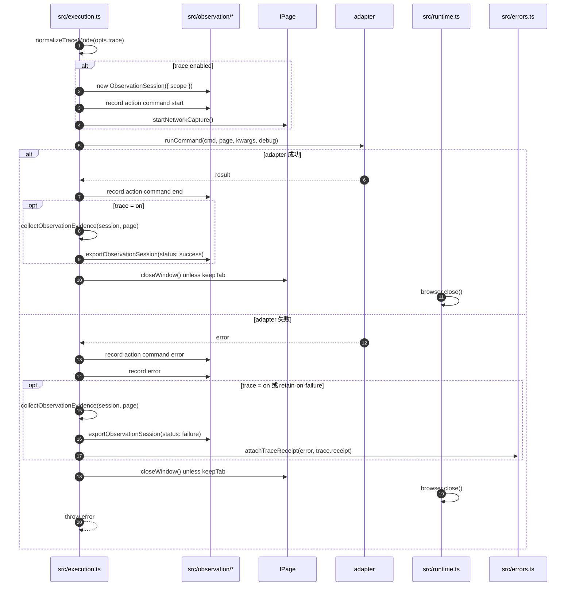

# Execution 5：Trace、错误和生命周期清理

这个文件解释 `execution.ts` 在 adapter 执行前后如何采集证据、导出 trace，以及失败时如何清理浏览器资源。

## 时序图



## 关键方法解析

| 方法 | 文件 | 作用 | 关键点 |
|---|---|---|---|
| `normalizeTraceMode(opts.trace)` | `src/execution.ts` | 解析 trace 模式。 | `off` 不采集；`on` 成功失败都导出；`retain-on-failure` 只在失败时保留。 |
| `new ObservationSession({ scope })` | `src/execution.ts:261` | 创建一次 trace 会话。 | scope 包含 command、site、session、contextId、target、adapterSourcePath。 |
| `page.startNetworkCapture()` | `src/execution.ts:278` | 开启网络捕获。 | 普通网站路径最终走 extension CDP Network domain；不支持时降级。 |
| `collectObservationEvidence(session, page)` | `src/execution.ts:401` | 收集失败/成功现场证据。 | 并行取 URL、snapshot、network、console、screenshot。 |
| `exportTraceArtifact(session, status, error)` | `src/execution.ts:448` | 写出 trace artifact。 | 失败时会把 trace receipt 附到 error 上，CLI 错误输出会带 trace 信息。 |
| `attachTraceReceipt(error, trace.receipt)` | `src/errors.ts` | 把 trace 元信息挂到错误对象。 | AutoFix 就靠这个找到 `summary.md` 和 adapter 源文件。 |
| `page.closeWindow()` | `src/browser/page.ts:189` | 释放 extension 侧 tab lease。 | ephemeral adapter 默认执行完就释放，避免 automation tab 泄漏。 |
| `browser.close()` | `src/runtime.ts:91` | 关闭当前 bridge 对象。 | 对 `BrowserBridge` 不会杀 daemon，只清理本地引用；daemon 是持久进程。 |
| `sendCommandRaw()` retry | `src/browser/daemon-client.ts:175` | daemon 命令发送重试。 | 网络错误、重复 command id、部分瞬时浏览器错误会重试。 |
| `unregisterExtensionConnection(ws)` | `src/daemon.ts:140` | extension 断连时处理 pending 命令。 | 会 reject 属于该 profile 的 pending 请求，避免 CLI 永远挂住。 |

## 关键代码摘录

trace 会话是在 browser branch 里创建的：

```ts
const observation = traceMode === 'off'
  ? null
  : new ObservationSession({
      scope: {
        contextId,
        session,
        target: page.getActivePage?.(),
        site: cmd.site,
        command: fullName(cmd),
        adapterSourcePath: resolveAdapterSourcePath(internal),
      },
    });

if (observation) {
  // 记录命令开始和参数。
  observation.record({
    stream: 'action',
    name: 'command',
    phase: 'start',
    data: { args: kwargs },
  });

  // 开启网络捕获；普通网站路径最终由 extension CDP Network domain 实现。
  await page.startNetworkCapture?.().catch(() => false);
}
```

成功时，`trace=on` 才会导出；`retain-on-failure` 成功时不保留：

```ts
const result = await runWithTimeout(runCommand(cmd, page, kwargs, debug), {
  timeout: browserTimeout,
  label: fullName(cmd),
});

observation?.record({
  stream: 'action',
  name: 'command',
  phase: 'end',
});

if (observation && traceMode === 'on') {
  await collectObservationEvidence(observation, page).catch(() => {});
  exportTraceArtifact(observation, 'success', undefined, opts.onTraceExport);
}

// adapter 命令默认是一次性的，除非 keepTab=true，否则释放 tab lease。
if (!keepTab) await page.closeWindow?.().catch(() => {});
```

失败时，`trace=on` 和 `retain-on-failure` 都会导出现场：

```ts
catch (err) {
  if (observation) {
    observation.record({
      stream: 'action',
      name: 'command',
      phase: 'error',
      data: { error: err instanceof Error ? err.message : String(err) },
    });

    observation.record({
      stream: 'error',
      message: err instanceof Error ? err.message : String(err),
      stack: err instanceof Error ? err.stack : undefined,
    });

    if (traceMode === 'on' || traceMode === 'retain-on-failure') {
      await collectObservationEvidence(observation, page).catch(() => {});
      exportTraceArtifact(observation, 'failure', err, opts.onTraceExport);
    }
  }

  if (!keepTab) await page.closeWindow?.().catch(() => {});
  throw err;
}
```

`collectObservationEvidence()` 会并行收集最终状态：

```ts
async function collectObservationEvidence(session, page) {
  const target = page.getActivePage?.() ?? session.scope.target;

  const [url, snapshot, networkEntries, consoleMessages, screenshot] =
    await Promise.all([
      page.getCurrentUrl?.().catch(() => null),
      page.snapshot().catch(() => undefined),
      page.readNetworkCapture?.().catch(() => []),
      page.consoleMessages('all').catch(() => []),
      page.screenshot({ format: 'png' }).catch(() => undefined),
    ]);

  // 后面会把这些材料写入 state/network/console/screenshot stream。
  session.record({ stream: 'state', url, target, snapshot, label: 'final' });
}
```

`exportTraceArtifact()` 负责落盘和把 trace receipt 挂到错误上：

```ts
function exportTraceArtifact(session, status, error, onTraceExport) {
  const trace = exportObservationSession(session, { error, status });

  if (status === 'failure' && error !== undefined) {
    // 失败时把 receipt 附到 error 上，CLI 错误 envelope 就能提示 trace 路径。
    attachTraceReceipt(error, trace.receipt);
  } else {
    process.stderr.write(`byCLI trace artifact: ${trace.dir}\n`);
  }

  onTraceExport?.(trace);
  return trace;
}
```

## trace 模式区别

| 模式 | 成功时 | 失败时 | 使用场景 |
|---|---|---|---|
| `off` | 不导出 | 不导出 | 默认模式。 |
| `on` | 导出 trace | 导出 trace | 需要完整复盘一次命令。 |
| `retain-on-failure` | 不保留 | 导出 trace | 修 adapter 最常用，失败才留下证据。 |

## trace 里会收集什么

`collectObservationEvidence()` 会尽量收集：

- 当前 URL：`page.getCurrentUrl()`。
- 页面快照：`page.snapshot()`。
- 网络请求：`page.readNetworkCapture()`。
- 控制台消息：`page.consoleMessages("all")`。
- 截图：`page.screenshot({ format: "png" })`。

这些证据会进入 trace artifact，方便后续 `bycli-autofix` 或人工排查。

## 生命周期清理

browser adapter 执行完成后有两层清理：

1. `page.closeWindow()`：告诉 extension 释放 tab lease。
2. `browser.close()`：关闭当前 `BrowserBridge` 或 `CDPBridge` 对象。

注意：`BrowserBridge.close()` 不会杀 daemon。daemon 是持久进程，会继续等下一次 browser 命令复用。

如果 `keepTab=true` 或 `siteSession=persistent`，`execution.ts` 不会调用 `page.closeWindow()`，这样同一个站点后续命令可以复用页面状态。
